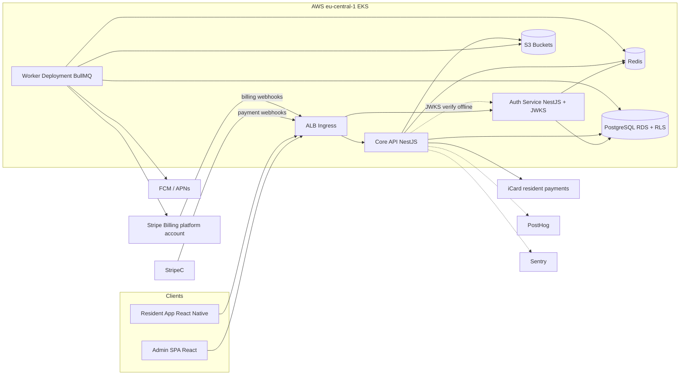
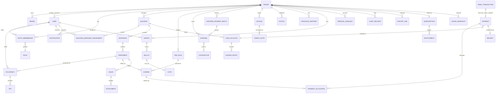
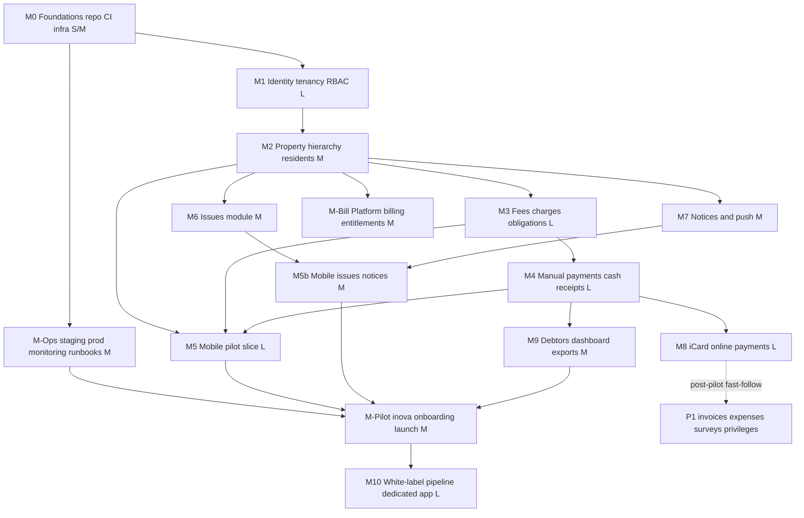

# inova — Multi-Tenant White-Label Property Management Platform
## Implementation Plan (v1.0 — planning only, no code written)

> **Progress does not live here.** Current state: [current.md](current.md).
> Milestone acceptance: [milestones/](milestones/). Architecture extract:
> [architecture.md](architecture.md). The checklist in §15 is a planning
> backlog, not a living tracker — do not tick boxes here.

--- 


## Executive summary

inova is a multi-tenant B2B SaaS platform for professional property-management companies, consisting of (1) a web admin panel for property managers, (2) a white-label resident mobile application, and (3) a shared backend. The pilot launches in Bulgaria under the platform's own **inova** brand (acting as the first tenant). The commercial model bills each tenant monthly **per managed property unit** (represented by an apartment/property row, never by the number of accounts, owners, tenants, or occupants) for a predefined base feature bundle, at a **per-tenant configurable unit price defaulting to 0.80 EUR**, managed by a platform `super_admin` role through the UI (including bulk price updates across all tenants). Premium add-on features (AI integration, shared document signing for block meetings) carry additional per-property fees. Expansion targets are Romania, Serbia, and Poland.

The repository is **empty** (an initialized git repo with zero commits), so this is a **pure greenfield project**. There are no existing conventions, prototypes, or technology constraints to inherit. The functional scope supplied in the project brief is treated as the authoritative specification (no PDF file exists in the repository).

Key recommendations, detailed and justified below:

- **Architecture (decided by stakeholder):** a **small fixed set of services from day one**: a dedicated **auth service** (issues JWTs carrying one tenant-account realm and multiple applicable roles, verified by other services via JWKS — no runtime call to auth on every request), a **core API** (domain modules behind strict internal boundaries), and a **worker** (queues/cron). Tenant-facing accounts are independent per tenant, including when the same email or phone is used in another white-label application. A person may authenticate accounts in several tenants and the shared mobile app keeps those sessions in a secure local portfolio for explicit tenant switching; every token and API request still authorizes exactly one tenant. Platform operators use separate platform identities. This honors the microservices direction where it pays off (authentication as an isolated security domain) while keeping domain modules co-deployed for low hosting cost; further extraction seams (payments, notifications, exports) remain designed-in.
- **Stack:** TypeScript everywhere. NestJS backend services, PostgreSQL 16 with row-level security for tenant isolation, Redis + BullMQ for background jobs, React (Vite) admin panel, React Native (Expo) resident app, S3 for object storage, Terraform + Helm for infrastructure, GitHub Actions for CI/CD, PostHog for product analytics (already in the team's toolchain), Sentry for errors.
- **Payments (stakeholder preference, validation required):** **iCard** is the preferred provider for resident online payments. Before M8 is locked, confirm its tenant merchant/account structure, settlement flow, Bulgarian onboarding/KYC, payment initiation, webhooks, refunds, reconciliation, and sandbox capabilities. The domain remains behind a `PaymentProvider` port and the pilot can use bank transfer/manual reconciliation. Platform revenue (0.80 EUR/managed property unit + add-ons, never per end-user account) remains a separate subscription flow; Stripe Billing is the current default for that platform-to-tenant billing unless stakeholders choose otherwise.
- **Database scale:** designed for **2,000+ tenants with thousands of end customers each**. Shared schema with `tenant_id`-leading composite indexes and RLS as the baseline; declarative **hash partitioning by `tenant_id`** on high-volume tables as they grow; Citus/sharding as the scale-out path. Schema-per-tenant is explicitly rejected at this tenant cardinality (§4.7 explains why).
- **White-label:** one shared mobile codebase, two distribution modes — (A) dedicated per-partner apps compiled from brand config with unique bundle IDs, submitted from the *partner's own* Apple/Google developer accounts, and (B) a shared multi-brand app with runtime tenant selection for smaller partners. A store-compliance program (differentiation records, partner-as-provider onboarding) mitigates Apple 4.3 Spam / Google Repetitive Content risk.
- **Tenant isolation:** every request is authorized by its authenticated tenant-account context; PostgreSQL RLS enforces `tenant_id` scoping at the database layer as a second line of defense. A client-side tenant or role switch changes presentation/context only. Bundle ID / client config is never a security boundary.
- **Financial correctness:** immutable ledger-style records (charges, payments, allocations); corrections happen only via reversal/credit-note entries; gapless per-tenant document numbering; idempotent payment webhooks.
- **Pilot path:** milestones are ordered so a thin end-to-end slice (admin creates building + resident accounts → resident activates via invite code, sees obligations, pays by bank reference → admin records payment) is testable as early as milestone M5, before online payments, surveys, or white-label tooling.
- **Resident onboarding (decided by stakeholder):** residents do **not** self-register. The tenant (house manager) creates the resident account with the verified apartment/address data, and the platform sends a one-time **invite code via SMS or Viber**; the resident activates the account by entering the code. This guarantees address correctness and removes form-filling friction for end users.

---

## Brand identity

The platform's own product and pilot brand is **inova**, operated by
**WhiteNova Technology**. Its product description is "Community management for
apartment buildings and neighborhoods." Brand values: neighborly, trustworthy,
organized, and tech-forward.

The mobile welcome screen uses this hero artwork (inova wordmark composited in); it is the
source image for `apps/mobile/assets/images/welcome-hero.jpg` and must be shown uncropped,
width-fit and bottom-anchored:


| Token | Hex | Usage |
|---|---|---|
| Santiago Orange | `#EB5E28` | Primary actions and product accent |
| Cold Foam | `#EFECE3` | Light application background |
| Gold Black | `#1D1D1F` | Primary text and dark background |
| Warm Dark | `#2C2324` | Dark surfaces |
| Landmark | `#766754` | Secondary text |
| Stone | `#A79D90` | Neutral accent |

- Primary gradient: orange-bright → Santiago Orange (`#FF7E47` → `#EB5E28`).
- Tagline: **"Together. Better. Home."** — the three periods carry blue/green/purple respectively.
- Machine-readable source of truth: [brands/inova/brand.json](../brands/inova/brand.json)
  (palette, gradients, light/dark theme tokens, radii, feature flags). UI code must consume
  these tokens — mobile via `apps/mobile/src/theme/tokens.ts`, admin via the Tailwind
  `@theme` block in `apps/admin/src/styles.css` — never hardcoded hex values.

---

## 1. Repository assessment

| Question | Finding |
|---|---|
| What exists | Nothing. `/Users/mihailsfolder/dev/inova` contains only an initialized `.git` directory with **zero commits**, no branches, no files. |
| Reusable code / prototypes | None found. |
| Existing conventions or technology decisions | None in the repository. One external signal: the user's stored Cursor rules describe React Native screen conventions (conditional styling by `screenWidth`, Android-first support), implying prior/intended React Native mobile work — this plan adopts React Native accordingly. A PostHog MCP integration is configured in the workspace, implying PostHog is the intended analytics tool. |
| Database definitions, deployment files, docs | None. |
| PDF specification | Not present in the repository. The functional scope from the project brief is treated as the spec; the traceability matrix in §14 maps that scope. |
| Verdict | **Greenfield.** All foundations (monorepo layout, CI, environments, schema, apps) must be created. Technical debt: zero, but so is leverage — every choice below is a fresh decision. |

---

## 2. Clarifications and assumptions

### 2.1 Blocking questions (need stakeholder answers before the affected milestone starts)

| # | Question | Blocks | Why it matters |
|---|---|---|---|
| B1 | **DIRECTION CHANGED — iCard is preferred for resident online payments.** | M8 | Before implementation, validate iCard's tenant merchant/account and settlement model, Bulgarian onboarding/KYC, APIs/SDKs, webhook signing and event model, refunds, reconciliation, sandbox, and whether inova ever handles funds. The previous Stripe Connect Standard decision is superseded, not silently retained as an implementation assumption. |
| B2 | **Invoicing and fiscal compliance in Bulgaria** — Are the management companies VAT-registered? Must invoice numbering be gapless 10-digit per Bulgarian VAT law? The selected PSP and merchant-of-record model may affect receipt obligations, so an accountant must confirm the receipt/invoice PDF templates, VAT cases, numbering, corrections, and any N-18 implications after B1 is validated. | M4 (receipt templates), M9 (invoices) | Legal requirement for the documents tenants issue. **Requires a Bulgarian accountant's confirmation — do not guess.** |
| B3 | **RESOLVED — service topology fixed:** dedicated auth service from day one (tenant-account realm and roles coded into the JWT), core API as co-deployed domain modules, separate worker. See §4.1. | — | Decided by stakeholder; B8 later replaced the original cross-tenant membership claim shape with a single tenant realm per account token. |
| B4 | **RESOLVED — pilot data lives in Excel / Google Sheets.** Import tooling = spreadsheet importers (buildings, apartments, residents, opening balances) with dry-run and row-level error reporting. Remaining detail: obtain sample files early to fix column mappings before M2's bulk import is built. | M2 (import shape), M-Pilot | Opening-balance correctness is the #1 pilot trust factor. |
| B5 | **RESOLVED — the pilot runs in the shared app under the platform's own inova brand.** Dedicated white-label apps (M10) start when the first external white-label partner signs. | — | Removes store-review risk from the pilot's critical path entirely. |
| B6 | **RESOLVED — billable unit = managed property/apartment row associated with a tenant, never an end-user account.** The platform fee is **paid by the tenant organization, never by the owner/tenant/occupant** — residents only pay their building fees through the tenant's configured payment channels. The per-property unit price is **configurable per tenant through the UI** by a platform-level `super_admin` role, with a **bulk update** option to set the price across all tenants at once. Default 0.80 EUR. | — | Decided by stakeholder. Multiple owners/occupants/accounts on one property still count as one unit. Metering counts managed property rows; price comes from tenant billing config; platform subscription provider is independent from the resident-payment provider. |
| B7 | **RESOLVED — invite-code resident onboarding.** The house manager creates the resident account (with verified apartment/address) in the tenant realm; the platform sends a one-time activation code via **SMS or Viber**; the resident enters the code in the app to activate. No resident self-registration; the self-service link-request flow becomes an admin-verified fallback. Remaining detail: choose SMS/Viber gateway (e.g. Twilio, Infobip — both support Viber Business Messages in BG) before M1 ships. | M1 (auth flows), M2 (occupancy model) | Decided by stakeholder. Ensures address truth and removes signup friction. |
| B8 | **RESOLVED — tenant-scoped account realms with explicit multi-tenant switching.** Tenant-facing accounts are unique by normalized email or phone **within a tenant**, not globally. The same person may create or activate independent accounts with the same contact details in several tenants. The shared mobile app may keep several separately authenticated tenant sessions and let the person switch the active tenant; each JWT, refresh-token family, API request, cache namespace, and push registration remains bound to one tenant account. Accounts are never automatically merged or exposed across tenants, and no tenant learns that another uses the same provider. Platform operators remain separate platform identities. | M1 refactor before M2 | Supersedes the original global-user / multi-membership authorization model without removing the multi-tenant user experience. Dedicated apps expose only server-mapped realms; the shared app adds a realm through invitation/organization selection. A tenant or role switch is a context/presentation operation, never authorization by itself. |
| B9 | **RESOLVED — property identity and occupancy roles.** An apartment's unique business key is `(building, entrance, floor, apartment_number)` within the tenant. Every person uses an independent account/session and receives role-derived capabilities from effective-dated occupancies. Multiple people may simultaneously hold the `owner` role for one apartment; voting is owner-only. | M2 | Keeps co-ownership explicit and prevents tenant/occupant accounts from seeing owner-only functions. The UUID remains the technical key; the composite is the user-visible uniqueness constraint. |
| B10 | **RESOLVED — controlled removal.** House managers may add residents and correct profile/property data but may not directly remove resident accounts or active property records. They submit a reasoned removal request to `super_admin`. Apartments may be freely added/removed while a building is in setup/draft; after activation, removal requires the same request/approval workflow and preserves history through archival rather than hard deletion. | M2 | Makes destructive changes auditable while keeping initial portfolio setup practical. |
| B11 | **RESOLVED — survey proposal and approval.** Verified owners may propose surveys. A house manager approves a proposal before it becomes visible, at which point all eligible owners in the building receive a push. The house manager chooses the voting basis per survey: one weight per apartment or weight by ideal parts. | P1 surveys | Owner-only eligibility and the per-survey weighting mode are decided. The allocation of one apartment's vote among multiple co-owners still requires a specific rule/legal confirmation. |
| B12 | **OPEN — EGN and identity-card data for enforcement claims.** Confirm with Bulgarian legal counsel and the intended public/private enforcement-agent process whether these identifiers or document details are legally required. | M2 data model / pre-pilot compliance | Do not add them to the general account profile by default. If required, define exact fields, lawful basis, who may view/export them, encryption, audit, retention, correction, and erasure rules in a separate purpose-limited legal-identity record. |

### 2.2 Decisions that can safely use defaults (recommended defaults for the Bulgarian pilot)

| Area | Recommended default | Notes / assumption flag |
|---|---|---|
| Resident payment provider | **iCard preferred; integration contract pending B1 validation.** Keep a provider-neutral `PaymentProvider` port and bank-transfer/manual-payment fallback. | Do not assume Stripe-style connected accounts or a merchant-of-record model. Validate iCard onboarding, settlement, SDK/API, webhook, refund, reconciliation, and sandbox behavior before M8 schema/API lock. |
| Platform billing | **Stripe Billing** on the platform account: per-tenant subscription, monthly metered quantity = **managed property/apartment rows, never user accounts** (B6 resolved), unit price **configurable per tenant** via super_admin UI (default 0.80 EUR, bulk-update across all tenants), plus per-property add-on prices per premium feature (AI integration, document signing) | Entitlement flags enforced server-side per tenant; metering job snapshots monthly property counts (§5.2, M-Bill). Tenants are provisioned through the super_admin console, not by scripts. |
| Invoicing | Generate PDF invoices/receipts in-app with per-tenant gapless numbering series; no fiscal-device integration in MVP | *Assumption pending B2 (template sign-off only).* Marked as legal risk in risk register. |
| Mobile technology | **React Native + Expo (prebuild workflow)**, TypeScript | Matches team's existing RN conventions; one codebase for iOS+Android; EAS/fastlane support per-brand builds. |
| Admin web | **React 18 + Vite + TypeScript**, TanStack Router/Query, shadcn/ui + Tailwind | SPA is sufficient (authenticated tool, no SEO); cheaper to host (S3+CloudFront) than SSR. |
| Backend | **NestJS (Node 22, TypeScript)**: auth service + core API (domain modules) + BullMQ worker | First-class DI/module boundaries, OpenAPI generation, mature ecosystem, single language across stack. |
| Database | **PostgreSQL 16 (RDS)**, single database, shared schema with `tenant_id` + **row-level security**; hash partitioning on hot tables as volume grows (§4.7) | Schema-per-tenant rejected at 2,000-tenant scale — rationale in §4.7. Per-tenant DBs remain an enterprise-tier option for a handful of large clients. |
| Authentication | **Dedicated auth service (decided)**: tenant-scoped account realms, email/phone + password (argon2id), email/phone OTP verification, JWT access (10–15 min, RS256/ES256 via JWKS) with one **tenant id + account kind + multiple roles** per token, separate platform identities, rotating refresh tokens; staff SSO later. The shared mobile app may securely retain one refresh-token family per authenticated tenant account and switch active contexts. | Avoids Cognito/Auth0 per-MAU cost and keeps EU data residency straightforward. The same normalized email/phone may exist once per tenant and must never disclose or automatically link another tenant's account. Token/caches/push registrations are tenant-account namespaced; claim staleness is bounded by short TTL + revocation denylist (§4.1). |
| Push notifications | **Firebase Cloud Messaging (Android) + APNs (iOS)** via a `PushProvider` abstraction; Expo Notifications client-side; per-brand Firebase project + APNs key for dedicated apps | Vendor-neutral server abstraction so Expo Push service can be used for shared app if convenient. |
| File storage | **S3** (eu-central-1), presigned upload URLs, per-tenant key prefixes, private buckets + CloudFront signed URLs for delivery | MinIO in docker-compose for local dev parity. |
| Localization | `bg` + `en` from day one; i18next (admin, mobile) + ICU messages; all user-facing strings externalized; currency/locale from tenant settings | `ro`, `sr`, `pl` are translation files + locale data only — no code changes. Serbian needs Cyrillic/Latin script toggle (P2). |
| Hosting | Local: docker-compose. Staging + production: **one small EKS cluster** with namespace separation (`staging`, `production`), 2–3 spot+on-demand mixed nodes, RDS t4g.small, ElastiCache/Upstash Redis | *Cost note:* EKS control plane is ~$74/mo; ECS Fargate would be cheaper but the brief mandates EKS. Keep one cluster for both envs until revenue justifies two. |
| GDPR | EU-only data residency (eu-central-1), DPA with tenants, consent records, export + erasure workflows (see §6.6) | Platform is processor; management company is controller. *Assumption:* confirm with counsel. |
| Backups | RDS automated backups (PITR, 14 days) + nightly logical dumps to S3 (90-day retention, versioned, cross-region replica); quarterly restore drills | |
| Accounting integration | None in MVP; a stable **export boundary** (§8.4): normalized journal-export format (CSV/XLSX) + `AccountingExportAdapter` interface | *Assumption:* no specific target system named yet. |
| Currencies | BGN only at pilot; all money stored with explicit `currency` column from day one | Bulgaria's planned euro adoption makes dual-display (BGN/EUR) a P1 requirement — flagged as assumption A-EUR. |
| Time zone | Tenant-level IANA timezone (`Europe/Sofia`); all timestamps stored UTC | |

### 2.3 Explicit assumptions (marked, not invented as business rules)

- **A-FEE (RESOLVED):** Monthly fees are generated on a tenant-configurable day of month with **no proration** — the fee rule in effect on generation day applies for the whole month; mid-month basis changes (occupant count, ownership) take effect from the next period.
- **A-ALLOC (RESOLVED):** Payment allocation is **oldest debt first**, with per-payment manual override by the manager.
- **A-ACCOUNT (RESOLVED):** Tenant-facing accounts are tenant-scoped. Unique indexes are `(tenant_id, normalized_email)` and `(tenant_id, normalized_phone)`; a contact value used in tenant A may be registered independently in tenant B. A person may keep several such accounts in the shared mobile app and switch the active tenant explicitly, but the server does not issue a cross-tenant account token or expose an automatic account link. Login, activation, reset, token families, caches, push registrations, enumeration protection, and audit are realm-scoped. Platform identities are separate.
- **A-APARTMENT (RESOLVED):** Apartment uniqueness within a tenant is `(building, entrance, floor, apartment_number)`. The row still uses a UUID technical id and tenant-leading primary key.
- **A-OCCUPANCY (RESOLVED):** Occupancies and pets have `valid_from` / `valid_to`. Occupant- and pet-sensitive calculations use the records effective for the applicable fee period. Each co-owner has a separate `owner` occupancy; owner-only permissions are enforced server-side.
- **A-BUILDING-FEE (RESOLVED):** The building's assessment basis is configured during setup (`fixed`, `per_area`, `per_occupant`, `per_ideal_part`, with room for later bases). Changes are effective-dated/versioned so they do not rewrite generated charges.
- **A-REMOVAL (RESOLVED):** House managers can add and correct but cannot directly remove resident accounts or active apartments. Removal is a reasoned request approved by `super_admin`; records with history are archived/ended, not hard-deleted. Draft-building apartments are editable until the building is activated.
- **A-DEPOSIT (RESOLVED):** Operational and deposit/repair funds are logical sub-ledgers over the same real building bank account. Each building configures whether transfers between them are allowed; permitted transfers create balanced ledger entries and remain permission-gated and audited.
- **A-BANK-MATCH (RESOLVED IN PART):** External inbound bank transactions are ingested and matched to an apartment primarily by the payment reference. Unmatched items stay in a reconciliation queue for staff resolution and do not silently mutate the ledger. The disposition of a true overpayment after an apartment is identified remains open.
- **A-DOCUMENT-RECIPIENT (RESOLVED):** The house manager designates one verified owner occupancy as the apartment's document recipient. Receipts/invoices for that apartment are addressed and delivered to that owner until the designation changes, without rewriting past documents.
- **A-EXPENSE-PAYMENTS (RESOLVED):** A house manager may prepare and initiate multiple contractor payments as a batch and may configure recurring contractor payment schedules. Each realized payment remains an individual immutable financial event linked to its expense and batch/schedule.
- **A-VERIF:** Resident-to-apartment linking always requires manual admin approval in MVP (no self-serve codes bypassing review).
- **A-EUR:** Bulgaria euro transition may require dual currency display and conversion during the platform's life; schema supports it, UI work deferred to P1.
- **A-PRIV:** Privilege partners are managed per-tenant (a partner belongs to one management company), not platform-global.
- **A-METER (RESOLVED):** Monthly platform billing counts apartments at **period close** — an apartment archived mid-month is not billed; one added mid-month is billed in full. The metering query still sits behind one interface should the rule ever change.
- **A-SURVEY (RESOLVED IN PART):** A verified owner may propose a survey; a house manager approves/rejects it. Approval publishes it to the building's owners and queues push notifications. The manager chooses `per_apartment` or `per_ideal_part` weighting per survey. Co-owner ballot sharing/splitting remains open.
- **A-LEGAL-IDENTITY (OPEN):** Do not collect EGN or identity-card data until counsel confirms it is necessary for enforcement-agent claims. If confirmed, store the minimum required fields separately from the general user profile, encrypted and access-controlled, with purpose-specific audit and retention rules.
- **A-MANAGER (RESOLVED):** The tenant organization may be a property manager or a developer/builder. House-manager authority is a tenant/building-scoped assignment, independent of the person's employer: it may be granted to a resident owner, tenant staff, or a platform-employed operator. A platform-employed house manager acts through the scoped assignment, not through unrestricted `super_admin` access.

---

## 3. MVP boundaries

### P0 — required for a usable inova pilot

| Feature | Rationale |
|---|---|
| Tenant + brand + staff accounts, granular roles | Foundation for everything |
| Buildings → entrances → apartments hierarchy | Core inventory |
| Manager-created resident accounts + invite-code activation (SMS/Viber), login | Core resident onboarding — manager owns address truth (B7) |
| Resident profile (contacts, occupants, pets) | Needed for building records; simple CRUD |
| Recurring monthly fee rules (per apartment / per m² / per occupant / fixed) + fee generation job | The product's economic heart |
| One-time and temporary charges | Managers need it in week one |
| Obligations view (current + history) in mobile app | Primary resident value |
| IBAN + payment reference display with copy actions | How most residents will actually pay at pilot |
| Manual payment entry with allocation across fee items + payment method | Managers reconcile bank transfers daily |
| Operational cash account + deposit account, per-building summary + transaction history | Requested core financial visibility |
| Receipts linked to payments/apartments (PDF) | Legal/trust necessity (pending B2 shape) |
| Issue reporting with photos, status flow (reported → planned → resolved), admin management | High-frequency engagement feature |
| Notices feed with categories; admin publish to all/selected | Replaces the paper notice board |
| Push notifications (payment recorded, notice published, issue status) | Pilot retention driver |
| Debtor report with filtering/sorting | Named must-have for managers |
| Basic dashboard (portfolio totals, debtors, open issues) | Manager daily entry point |
| Audit log on financial and permission-changing actions | Non-negotiable for money handling |
| Light/dark theme, help/support screen, payment instructions | Small, listed in scope |
| inova data import tooling (buildings, apartments, residents, opening balances) | Pilot cannot start without it |

### P1 — before broader commercial launch

| Feature | Why deferred from P0 |
|---|---|
| Online payment via iCard + webhooks + reconciliation + refunds | Highest-risk integration and provider contract still requires validation; pilot works with bank transfer + manual entry. Validate early and build immediately after pilot start (M8). |
| Platform billing: Stripe Billing subscriptions, 0.80 EUR/managed-property metering (never per user), entitlement flags (M-Bill) | Pilot tenant is the platform's own brand — nothing to invoice yet; must exist before the first paying tenant. Entitlement *flags* land earlier (M1 settings) so features can gate from the start. |
| Invoices and credit notes | Legal shape pending B2; receipts cover the pilot |
| Excel/PDF reporting and export (beyond debtor list) | Managers can survive with on-screen reports briefly |
| Contractor expenses and payments | Managers track externally at pilot; needed for full financial picture at launch |
| Recurring building expenses | Same as above |
| Surveys, voting, protocols | Legally sensitive (general-assembly rules in BG condo law), self-contained module |
| Privileges / local-business discounts | Engagement feature, not core money flow |
| Shared multi-brand app tenant selection (invite / org code) | Pilot has one tenant; mechanism needed at second customer |
| Dedicated white-label build pipeline + first partner's dedicated app | Pilot runs in the shared app under the inova brand (B5 resolved); dedicated apps start when the first white-label partner signs |
| Dual BGN/EUR display (A-EUR) | Regulatory timeline dependent |
| Push notification campaigns (manager-composed, targeted segments) | Basic pushes are P0; campaign UI is P1 |

### P2 — post-MVP / expansion

| Feature | Notes |
|---|---|
| AI integration (premium add-on, per-managed-property fee) | Scope undefined yet; gated behind an `ai_integration` entitlement from day one so pricing plumbing (M-Bill) is ready when the feature lands |
| Shared document signing for block meetings (premium add-on, per-managed-property fee) | Legally sensitive (qualified e-signature rules per country); gated behind a `document_signing` entitlement; pairs naturally with the surveys/protocols module |
| Romanian / Serbian / Polish localization + country packs (VAT, numbering, fiscal rules) | Architecture supports it; do when the market is real |
| Accounting-software synchronization (live API adapters) | Export boundary (P1 exports) comes first |
| Staff SSO (Google/Microsoft), 2FA hardware keys | Password + TOTP 2FA is enough earlier |
| Per-tenant database isolation tier | Sell to enterprise clients later |
| Resident-to-resident features, chat | Not in the brief; explicitly out of scope |
| Advanced analytics dashboards | PostHog covers early needs |

**Deferral reasoning:** the two riskiest work packages are (1) online payments (external dependency, compliance, money-loss potential) and (2) dedicated store apps (Apple/Google review risk, partner account logistics). Both are pulled out of the pilot's critical path: the pilot proves the product with bank-transfer + manual reconciliation in the shared app, while M8/M10 proceed in parallel without blocking pilot launch. Surveys/voting is deferred because Bulgarian condominium-assembly law makes "voting" legally loaded — better to ship it correctly than early.

---

## 4. Recommended architecture

### 4.1 Shape: microservices, minimal set (decided) — dedicated auth service + core API + worker

Stakeholder decision: microservices from day one, with authentication separated at minimum and the authenticated **tenant account realm + roles coded into the JWT**. Tenant-facing accounts are independent per tenant; this supersedes the original cross-tenant global-user login model. To honor this while keeping hosting cost minimal, the day-one topology is a **fixed set of three services** rather than a service-per-module fleet:

1. **`auth-service`** — owns tenant accounts, credentials, tenant-bound refresh-token families, staff role assignments, and separate platform identities. Tenant-account credentials are unique only inside their tenant realm; the same email/phone in another realm is an unrelated account and no auth response reveals that it exists. It issues short-lived (10–15 min) access tokens signed with an asymmetric key (RS256/ES256). Tenant token claims: `sub` (tenant-account id), `tenant_id`, `kind: staff|resident`, and `roles[]`; one account may carry several applicable roles, but every token authorizes only one tenant. Platform tokens use a separate platform subject with optional `platform_role` (`super_admin`, §6.2). The selected brand/organization identifies the realm before login through a server-side mapping, but is never authorization by itself. The shared mobile app may retain multiple tenant-bound sessions in secure storage and request a new access token for the selected context; the server does not mint one cross-tenant token. The service publishes a **JWKS endpoint**, so all other services verify tokens locally with zero runtime calls to auth — auth being down never blocks already-authenticated traffic.
2. **`core-api`** — the domain modules (`tenancy`, `property`, `billing`, `payments`, `finance`, `documents`, `issues`, `notices`, `notifications`, `privileges`, `surveys`, `reports`, `platform-billing`) behind strict internal boundaries.
3. **`worker`** — BullMQ consumers and cron (fee generation, push fan-out, PDFs, webhooks processing, metering, backups).

**Handling JWT claim staleness** (the trade-off of tenant/roles-in-token): access-token TTL of 10–15 minutes bounds how long a revoked role assignment can linger; for immediate revocation (staff dismissal, security incident) auth-service writes the account id to a small Redis denylist that core-api checks on each request (one O(1) lookup, no auth-service call). Refresh-token rotation re-reads the tenant account and role assignments from the database, so every token refresh picks up grant changes.

Rules that keep future extraction cheap (e.g., `notifications` for fan-out scale, `payments` for compliance blast-radius):

- Modules communicate through interfaces and an in-process event bus (NestJS CQRS events) — never by reaching into another module's tables.
- Each module owns its DB tables (enforced by lint rule on import paths + schema ownership doc).
- Async side effects (push, email, PDF, exports, webhook processing) run only in the worker via queues.
- Service-to-service calls (core-api → auth-service admin operations like invitations) go over authenticated internal HTTP with OpenAPI contracts, same as any future extracted service.

This deploys on EKS as 3 deployments + cron jobs — microservice boundaries where they carry their weight, without a 10-service fleet's cost.



### 4.2 Stack decisions with alternatives

| Layer | Recommendation | Alternative considered | Why the recommendation wins |
|---|---|---|---|
| Backend | NestJS + TypeScript (auth-service + core-api + worker) | Go (chi/ent), Django | One language across mobile/web/backend for a small team; NestJS modules map 1:1 to the service/module boundary strategy; OpenAPI + codegen for typed clients. Go wins on runtime cost but loses on team velocity here. |
| ORM / migrations | Drizzle ORM + drizzle-kit SQL migrations | Prisma, TypeORM | Plain-SQL migrations (needed for RLS policies, triggers, gapless counters); lighter runtime; Prisma's migration engine fights hand-written RLS. |
| DB | PostgreSQL 16 on RDS | Aurora Serverless v2 | RDS t4g is dramatically cheaper at pilot scale; Aurora is a config change later. |
| Admin | React + Vite SPA | Next.js | No SEO need; static hosting on S3/CloudFront ≈ free; simpler CI. |
| Mobile | React Native + Expo prebuild | Flutter, native ×2 | Team convention (existing RN rules), JS/TS reuse, EAS/fastlane multi-brand builds. Flutter equally capable but zero existing team signal. |
| Realtime updates | Polling + push notifications for MVP; SSE endpoint for admin dashboard later | WebSockets (Socket.io), managed (Ably) | Nothing in scope needs sub-second realtime; push covers resident freshness; avoids stateful WS infra on EKS at pilot. |
| Jobs | BullMQ on Redis | SQS + Lambda, Temporal | Same codebase/worker, local-dev parity via docker Redis; Temporal is overkill now. |
| Auth | Dedicated auth-service (tenant-scoped accounts, argon2id, JWT with tenant/account-role claims + rotating refresh, OTP, JWKS) | AWS Cognito, Keycloak, Auth0 | No per-MAU fees, EU residency trivial, full control of isolated white-label account realms (stakeholder requirement). Cognito is the fallback if the team prefers not to own password storage. |
| IaC | Terraform + Helm charts | CDK, Pulumi | Widest talent pool; Helm is native to EKS deploys via GitHub Actions. |
| Observability | CloudWatch logs + Prometheus/Grafana (kube-prometheus-stack) + Sentry + OpenTelemetry traces | Datadog | Datadog cost is unjustifiable at pilot; OTel keeps the exit door open. |
| Analytics | PostHog (cloud EU) | Amplitude, Mixpanel | Already in the team's toolchain (MCP configured); EU hosting; feature flags usable for white-label toggles. |
| PDF generation | Server-side via headless Chromium (Playwright) in worker | pdfkit, external API | HTML templates shared with web previews; runs only in worker to protect API latency. |

### 4.3 White-label strategy (one codebase, configuration-driven)

**Brand configuration model.** A `brands/` directory in the monorepo holds one folder per brand containing *non-secret* config: `brand.json` (colors, names, locales, feature flags, API base, deep-link domains, store metadata references) and asset folders (icons, splash, store screenshots). The backend serves the same brand config at runtime (`GET /v1/brands/:key/config`) so the shared app and server-rendered artifacts (emails, PDFs) stay consistent. Secrets (signing keys, APNs keys, service accounts) live **only** in the credentials store (§ White-label distribution, below) — never in `brands/`.

**Mode A — dedicated apps (larger partners).** `app.config.ts` reads `BRAND=inova` and produces unique bundle ID (`bg.inova.resident`), package name, display name, icons, deep-link associated domains, and Firebase config file per brand. CI builds each brand as a matrix job. Submission happens from the **partner's own** Apple Developer and Google Play accounts, with the platform operator invited in a release-manager role.

**Mode B — shared multi-brand app (smaller partners).** One store listing under the platform's accounts. A tenant realm is added via: (1) invitation deep link (`https://app.inova.bg/i/<token>`), or (2) organization code entry, then authenticated independently. Branding (theme, logo, strings) is applied at runtime from the brand config API and cached in a tenant-namespaced store. The app may retain several authenticated tenant contexts in secure storage and provide an explicit tenant switcher. Because accounts are tenant-scoped, it never searches other tenants for the same email/phone, never suggests that another account exists elsewhere, and never carries cached data or push context across a switch.

**Security/privacy invariant (both modes):** before login, the client's brand or organization code is a realm-selection hint resolved through a server-side brand-to-tenant mapping. It is not proof of access. After login, the selected session's signed `tenant_id` is authoritative and every API request is authorized against that tenant account and its effective roles. An account registered in tenant X is unrelated to an account with the same email/phone in tenant Y; locally presenting both authenticated contexts in the shared app does not merge them, and neither tenant is told about the other account or the shared platform provider. A role/view selector likewise changes presentation only and cannot add a permission.

### 4.4 Tenant isolation design

1. **Authentication layer:** a tenant-account JWT carries exactly one `tenant_id`, account kind, and roles (stakeholder decision), signed by auth-service and verified via JWKS. Platform identities are separate. Staleness is bounded by short TTL + revocation denylist + refresh-time re-read (§4.1).
2. **Request context:** every authenticated tenant route requires an explicit `X-Tenant-Id` header (or path param); middleware requires it to equal the signed token's `tenant_id` and derives the role set from the token. Absence or mismatch → 403 before any handler code runs. Highly sensitive operations (payments recording, role changes, refunds, removals, GDPR actions) additionally re-verify the tenant account/assignment against the database, not just the token.
3. **Database layer:** all tenant-owned tables carry `tenant_id NOT NULL`; RLS policies (`USING (tenant_id = current_setting('app.tenant_id')::uuid)`) are enabled on every such table. The API sets `app.tenant_id` per transaction. The application DB role is **not** `BYPASSRLS`; only the migration role is.
4. **Object storage:** S3 keys are prefixed `tenants/<tenant_id>/…`; presigned URLs are minted only after the same tenant-account and resource-scope check.
5. **Same person in multiple tenants:** the person registers or is invited as a separate account in each tenant realm, even when email/phone are identical. Dedicated white-label apps never expose the relationship. The shared app keeps a device-local index of explicitly authenticated tenant contexts, stores each refresh-token family under a tenant/account key, and switches by activating the chosen context. Server tokens, cached API data, offline queues, deep links, analytics identity, and push routing stay tenant-namespaced; switching never merges accounts or data.
6. **Tests as release blockers:** an automated tenant-isolation test suite (two seeded tenants, every endpoint called cross-tenant, expecting 403/404) runs in CI on every PR.

### 4.5 Multi-apartment / multi-building users

Tenant-facing `users`/accounts belong to exactly one tenant realm; normalized email and phone are unique within that tenant, not globally. A person can therefore participate in several tenants through several tenant accounts and switch between their independently authenticated contexts in the shared app. `occupancies` link an account to an apartment with a role (`owner`, `tenant`, `occupant`, `proxy`) and `valid_from`/`valid_to`. One account may hold many occupancies and several roles inside its tenant, and an apartment may have multiple simultaneous owners with separate accounts. Effective authorization is the server-validated combination of tenant role, manager assignment, selected building/apartment, occupancy role, and effective date. The mobile role/view selector changes navigation only: owner-only capabilities such as voting remain unavailable to tenant/occupant contexts. The mobile home screen provides tenant, role/view, and apartment switching as applicable; notifications carry `(tenant_id, account_id, apartment_id?)` context.

A tenant organization may be a professional property manager or a developer/builder. House-manager authority is modeled as a tenant/building-scoped assignment rather than inferred from who employs the person. The assignee may be tenant staff, a verified resident owner, or a platform-employed operator; the latter acts through the scoped tenant role and normal RLS, never through unrestricted `super_admin` access.

### 4.6 Localization

- All strings in `packages/i18n` (ICU MessageFormat), namespaced per module; `bg` and `en` maintained from day one.
- Locale, currency, date/number formats, and first-day-of-week come from tenant settings, overridable per user.
- No string concatenation in code; plurals via ICU. Romanian/Serbian/Polish become translation deliverables, not engineering work. Country-specific *legal* logic (invoice rules, VAT) is isolated in per-country policy modules (`packages/country-bg`, later `country-ro`, …).

### 4.7 Database performance and partitioning at 2,000+ tenants

Target scale to design for: **2,000+ tenants × 1,000–5,000 end customers each** → on the order of 2–10 M apartments/users, and the hot append-only tables (charges, ledger entries, notifications, audit records) growing by **tens of millions of rows per year**.

**Why schema-per-tenant is rejected at this cardinality.** 2,000 schemas × ~40 tables ≈ **80,000 relations** (plus indexes, easily 300k+ pg_catalog entries). Consequences: catalog bloat slowing planning and autovacuum, `pg_dump`/restore degradation, connection-pool fragmentation (poolers key on search_path), and — decisive for this product — **migration fan-out** (every schema change × 2,000, with partial-failure states) and **broken cross-tenant queries**, which platform billing (0.80 EUR/managed-property metering), platform analytics, and support tooling all require. Schema-per-tenant is a good pattern at ≤ 50 large tenants; it is the wrong pattern at 2,000 small ones.

**Adopted strategy, in escalation order:**

1. **Baseline (day 1):** single shared schema; `tenant_id` is the **leading column of every primary key and index** on tenant-owned tables (e.g., `PRIMARY KEY (tenant_id, id)`, `INDEX (tenant_id, apartment_id, period)`). Combined with RLS, every query plan is naturally tenant-pruned. Postgres on modest hardware handles hundreds of millions of well-indexed rows.
2. **Declarative partitioning (when a table crosses ~50 M rows or at commercial launch, whichever first):** `PARTITION BY HASH (tenant_id)` with a fixed partition count (32 or 64) on the hot tables — `ledger_entries`, `charges`, `payments`, `notifications`, `audit_records`, `issue_events`. Hash-by-tenant keeps each tenant's rows co-located for locality without 2,000 physical partitions. Because `tenant_id` leads every key, retrofitting partitioning is a data-copy migration, not a schema redesign — but partition the two largest append-only tables (`audit_records`, `notifications`) **from day 1** since they are pure inserts and cheap to start partitioned.
3. **Time-based subpartitioning / retention:** `audit_records` and `notifications` additionally range-partitioned by month (`pg_partman`) so retention becomes `DROP PARTITION` instead of DELETE storms.
4. **Read path:** read replicas for dashboards/reports/exports (reporting queries pinned to replicas); 5-minute cached rollups (§M9) keep dashboards off the raw ledger.
5. **Scale-out (when a single writer saturates):** Citus distributing by `tenant_id` (the schema is already shaped for it), or tenant-group sharding across databases with a tenant→shard directory in auth-service claims. Dedicated databases remain a sellable enterprise-tier option for a handful of very large tenants without changing the main fleet.

**Operational guardrails:** PgBouncer in transaction mode (compatible with `SET LOCAL app.tenant_id`), `work_mem`/autovacuum tuning documented per table class, slow-query log review as a runbook item, and a seed-data performance suite (200 → 2,000 tenant synthetic dataset) run before commercial launch.

---

## 5. Domain and data model

### 5.1 Entity map



### 5.2 Entity notes and status transitions

| Entity | Key notes | Status transitions |
|---|---|---|
| `tenant` | Client organization; may be a property-management company or a developer/builder. Holds locale/currency/timezone/settings JSON and provider-neutral resident-payment configuration. iCard-specific merchant/account identifiers and onboarding states are added only after B1 integration validation | `trial → active → suspended → offboarded` |
| `subscription` | Platform billing per tenant (Stripe Billing subscription id, **per-tenant unit price** — default 0.80 EUR per managed property/apartment row, never per account, super_admin-configurable with bulk update, price history kept for invoice auditability, currency, status) | `trialing → active → past_due → canceled` |
| `entitlement` | Feature grants per tenant: base bundle + add-ons (`ai_integration`, `document_signing`, …) with per-managed-property add-on price refs; enforced server-side by a feature guard; managed via super_admin console | `active → suspended → removed` |
| `usage_snapshot` | Immutable monthly metering record per tenant: **count of managed property/apartment rows, never accounts or occupants** (B6 resolved), per-entitlement counts, unit prices in effect, computed at period close; reported to Stripe Billing as metered usage | — |
| `brand` | 1..n per tenant; distribution mode (`dedicated`/`shared`); config JSON; store identifiers | `draft → live → retired` |
| `user` / tenant account | Belongs to one tenant realm. Normalized email and phone are each unique within that tenant but may repeat in other tenants. A person may authenticate several such accounts and switch them in the shared app, but credentials, token families, recovery, data, and user-facing identity remain tenant-bound and are never automatically merged or disclosed across realms | `pending_verification → active → disabled → erased(GDPR)` |
| platform user | Separate platform-operator identity; never reused as a tenant-facing resident account | `active → suspended → disabled` |
| `staff_membership` | Tenant-local `(user, role_set)` assignment; invitation-based. The same account may also hold resident occupancies | `invited → active → suspended → revoked` |
| `role` / permissions | Per-tenant custom roles composed of fixed permission keys (e.g. `billing.write`, `issues.manage`) | — |
| `building` / `entrance` / `apartment` | Building setup selects an assessment basis. Apartment carries floor, number, area m², property type and ideal parts. Unique business key: `(tenant, building, entrance, floor, apartment_number)`; UUID remains the technical key | building: `draft → active → archived`; apartment: `active → archived` |
| `occupancy` | Tenant-local `(user, apartment, role, valid_from/valid_to)`; admin-verified. One account may have several roles/occupancies and multiple simultaneous `owner` occupancies are allowed. A selected mobile view changes presentation only; effective server permissions remain context-derived and voting is owner-only | `requested → verified → active → ended → rejected` |
| `pet` | Linked to an occupancy/apartment with `valid_from/valid_to`, so pet-sensitive rules use the population effective for the fee period | `active → ended` |
| `building_manager_assignment` | Grants house-manager permissions for one or more buildings independently of employer. Assignee may be tenant staff, a resident owner, or a platform-employed operator acting through this scoped role | `invited → active → suspended → ended` |
| `removal_request` | Reasoned request by a house manager to remove/end a resident account/occupancy or archive an apartment after building activation; decided by `super_admin`, fully audited | `pending → approved / rejected → applied` |
| `fee_rule` | Basis comes from the building configuration: `fixed / per_area / per_occupant / per_ideal_part` (extensible); scope building/entrance/apartment-type; effective-dated and versioned (new version, never edit in place) | `active → superseded → archived` |
| `charge` | Immutable obligation row generated from a rule or entered ad hoc; `(apartment, period, amount, currency, due_date)` | `open → partially_paid → settled → reversed` (derived, see §5.4) |
| `bank_transaction` | Immutable external inbound transaction. Payment reference is used to propose an apartment match; unmatched/ambiguous items remain in a staff reconciliation queue and do not silently affect the ledger | `unmatched → proposed_match → matched / ignored` |
| `payment` | Immutable; source `manual / bank_import / provider`; provider code; source bank transaction or external payment/account refs; idempotency key. iCard is the preferred online provider pending B1 contract validation | `pending → confirmed → failed → refunded` (provider); manual are `confirmed` at entry, corrected only by reversal |
| `payment_allocation` | Immutable `(payment, charge, amount)` split | — |
| `cash_account` | Per building, logical `operational` and `deposit`/repair-fund sub-ledgers over the same real bank account; balances are **derived** from ledger. A building flag controls whether inter-fund transfers are allowed | — |
| `ledger_entry` | Append-only double-entry-style rows for every money movement (charge issuance optional, payment in, expense out, transfer between accounts, reversal) | — |
| `expense` | Building cost, optional contractor, optional recurrence/payment schedule. Realized payments stay immutable even when created from a schedule or batch | `draft → approved → paid → reversed` |
| `expense_payment_batch` | House-manager instruction grouping multiple contractor payments for one initiation/review action; every item produces its own payment/ledger history | `draft → submitted → processing → completed / partially_failed / failed` |
| `receipt` / `invoice` / `credit_note` | Numbered documents; gapless per-tenant series; rendered PDF stored in S3; invoice corrections only via credit note. The house manager designates one verified owner occupancy as the apartment's current document recipient | invoice: `issued → corrected → void(by credit note)` |
| `issue` | Reporter occupancy, category, photos | `reported → acknowledged → planned → in_progress → resolved → closed` (+ `rejected`); full history table |
| `attachment` | Polymorphic `(owner_type, owner_id)`; S3 key, mime, size, AV-scan status | `uploaded → scanned_clean / scanned_infected → deleted` |
| `notice` | Category, audience (all / buildings / entrances / apartments), publish window | `draft → published → archived` |
| `notification` | Per-recipient delivery record; channel push/email; payload ref | `queued → sent → delivered → failed → read` |
| `privilege_partner` / `privilege` | Tenant-scoped partner + offers with validity | `active → expired → disabled` |
| `survey` / `ballot` / `vote` | A verified owner proposes a survey; a house manager approves/rejects it and selects `per_apartment` or `per_ideal_part` weighting. Approval publishes to eligible building owners and queues push. Voting is owner-only and a vote is immutable once cast. Co-owner ballot allocation remains open | survey: `draft → pending_approval → approved / rejected → open → closed → protocol_issued` |
| `audit_record` | Append-only: actor, tenant, action, entity ref, before/after JSON diff, IP, request id | — |
| `export_job` | Requested report/export; produces S3 artifact | `queued → running → done → failed` |

### 5.3 Financial immutability and auditability

- `charge`, `payment`, `payment_allocation`, `ledger_entry`, `receipt`, `invoice`, `credit_note` are **append-only**: no UPDATE of monetary fields, no DELETE (enforced by DB triggers raising exceptions, plus revoked UPDATE/DELETE grants for the app role on monetary columns).
- Corrections are new rows: a wrong payment gets a `reversal` ledger entry + a reversing payment record referencing the original (`reverses_payment_id`); a wrong invoice gets a credit note.
- Every financial mutation writes an `audit_record` in the same transaction.
- Document PDFs are content-hashed; the hash is stored on the document row so tampering is detectable.
- Contractor payment batches and recurring schedules are instructions, not mutable substitutes for realized money movement: each execution creates individual immutable expense/payment/ledger records.
- External bank transactions affect apartment balances only after a deterministic or staff-confirmed match; the source transaction and matching decision remain auditable.

### 5.4 Calculated vs. stored

| Value | Stored or calculated | Rationale |
|---|---|---|
| Charge amount | **Stored** at generation time (rule inputs snapshotted onto the charge) | Rule changes must not rewrite history |
| Charge status (`open/partially_paid/settled`) | **Calculated** from allocations (materialized as a column updated by trigger for query speed, but derivable) | Single source of truth = allocations |
| Apartment / building outstanding balance | **Calculated** (SQL view); cached per-building aggregates refreshed by worker for dashboard | Avoid drift |
| Operational/deposit logical fund balance | **Calculated** from `ledger_entry` sum; periodic snapshot rows for fast paging and audit checkpoints | Both funds may share one real bank account; the logical ledger is truth |
| Debtor list | Calculated view | |
| Invoice totals, VAT lines | **Stored** on the document | Legal document must be frozen |
| FX conversions (future EUR) | Stored rate + both amounts on the document at issuance | Auditability |

### 5.5 Money, currency, time, numbering, idempotency, deletion

- **Money:** `NUMERIC(14,2)` + `currency CHAR(3)` on every monetary column; arithmetic in application code uses integer minor units (a `Money` value object in `packages/shared`); no floats anywhere. Rounding: half-up at document line level, documented per country module.
- **Currencies:** BGN at pilot; schema currency-explicit from day one; per-tenant default currency; dual-display for euro transition is UI work only (A-EUR).
- **Time zones:** DB `timestamptz` (UTC). Billing-period boundaries computed in the tenant's timezone by the fee-generation job. Dates that are legally "dates" (invoice date, due date) stored as `date`.
- **Document numbering:** `document_counters (tenant_id, series, next_value)` table; increment with `SELECT … FOR UPDATE` inside the issuing transaction → **gapless** sequential numbers per tenant and series (required for BG invoices pending B2). Receipts/invoices get separate series.
- **Idempotency:** client-supplied `Idempotency-Key` header on POST endpoints that create money records (manual payments, payment initiation); server stores `(tenant_id, key, response_hash)` for 48 h and replays the stored response on retry. Provider webhooks deduplicated by unique index on `(provider, provider_event_id)`.
- **Controlled removal / soft deletion:** house managers may add and correct data but cannot directly remove resident accounts or active apartments. During building `draft` setup, apartments may be added/removed freely. After activation, a reasoned `removal_request` requires `super_admin` approval; records with history are ended/archived, not hard-deleted. Other master data uses `deleted_at`. Financial records are never soft- or hard-deleted (reversals only). GDPR erasure anonymizes user PII columns while preserving financial rows (lawful basis: bookkeeping obligations — confirm retention periods with counsel, see §6.6).

---

## 6. Security and compliance

### 6.1 Authentication boundaries

- **Tenant-facing accounts (mobile/admin):** authentication is resolved inside an explicit tenant realm. Normalized email and phone are unique only within that tenant; the same values in another tenant identify an independent account. Login, invite activation, password reset, rate limits, and enumeration-safe responses are scoped to the realm and never disclose another tenant's account. Dedicated apps derive allowed realms from a server-side brand mapping; the shared app adds a realm by invitation or organization code and authenticates it independently. It may hold several tenant-bound refresh-token families in secure storage and switch the active context, but every access token contains exactly one tenant. Email/phone + password with OTP verification; refresh-token rotation with reuse detection; tenant/account-namespaced device records for push tokens.
- **Staff (admin):** same identity system, mandatory TOTP 2FA for roles holding financial permissions; session idle timeout; IP-logged logins.
- **Machine:** payment-provider webhooks (signature-verified, no session); internal cron/worker uses DB-scoped credentials, not user tokens.
- Passwords: argon2id, per-user salt; breach-list check on set; rate-limited login (per-IP and per-account, exponential backoff); account lockout with email alert.

### 6.2 Authorization

- **Platform-level roles (cross-tenant):** a `super_admin` role is held by separate platform-operator identities and carried as a `platform_role` claim in the JWT (never mixed with a tenant-facing resident account). super_admin provisions and initializes tenants through the UI, configures per-tenant billing (unit price, entitlements), bulk price updates, and decides reasoned resident/apartment removal requests. It can enter a tenant's context for support — every such access sets the tenant context explicitly, is RLS-scoped like any other request, and writes an audit record flagged `platform_access`. super_admin accounts require mandatory TOTP 2FA and are the only accounts allowed on platform-console endpoints.
- Permission keys grouped by module (`property.read`, `billing.write`, `payments.record`, `issues.manage`, `notifications.send`, `settings.roles`, `surveys.propose`, `surveys.approve`, `property.removal.request`, …). **Roles are per-tenant and may be building-scoped**: each tenant composes custom roles from the fixed permission-key catalog; the seeded starter set (Administrator, House Manager, Resident Owner, Resident Tenant — later Accountant, Support Agent, Read-only Auditor) is just a starting point. A house manager may be tenant staff, a resident owner, or a platform-employed operator assigned to specific buildings. Platform-employed managers use the scoped tenant role, not `super_admin`. **The first tenant account created for a tenant is assigned that tenant's `admin` role**. `super_admin` is never a tenant role.
- Guards run in order: authenticated → signed tenant-realm match → active account/assignment → permission key → occupancy/building scope. One account may simultaneously be staff, building manager, owner, tenant, occupant, or proxy in different scopes. The effective permission set is calculated for the active tenant and resource; a mobile role/view selector changes navigation only and never grants a permission. Owner-only operations such as proposing or voting in surveys are enforced server-side. A resident sees only apartments they occupy and permitted building-level aggregates.
- All list endpoints are tenant-scoped by construction (RLS backstop, §4.4).

### 6.3 Platform hardening

| Concern | Measure |
|---|---|
| Secrets | AWS Secrets Manager + External Secrets Operator into K8s; nothing in git; local dev via `.env` from 1Password/`direnv`; CI via GitHub OIDC → AWS (no long-lived keys) |
| Encryption | TLS everywhere (ALB + cert-manager); RDS + S3 encryption at rest (KMS); field-level encryption for IBANs and ID numbers if stored |
| Rate limiting | Global per-IP at ALB/WAF + per-user token bucket in API (Redis); stricter buckets on auth and payment endpoints |
| Uploads | Presigned S3 POST with content-type + size limits; server-side MIME sniffing; **ClamAV scan** in worker before an attachment becomes visible; images re-encoded (strips EXIF/GPS and defuses polyglots) |
| Payment webhooks | Provider signature verification (e.g., Stripe signing secret), timestamp tolerance, replay-proof via event-id unique index; webhook endpoint excluded from auth middleware but allowlisted by path |
| Card data | **Never touches our servers** — provider-hosted payment page / SDK tokenization only (SAQ-A scope) |
| Headers/CSP | Strict CSP on admin SPA, HSTS, secure cookies (admin), certificate pinning consideration for mobile (P1) |
| Dependencies | Renovate + `npm audit` gate in CI; container image scanning (Trivy) in CI |
| Audit | §5.3 audit records + admin-visible audit trail screen (P1); infra audit via CloudTrail |

### 6.4 Backups and recovery

RDS PITR (14 d) + nightly `pg_dump` to versioned S3 with 90-d retention and cross-region replication; S3 attachment bucket versioning; documented RPO ≤ 24 h (target ≤ 1 h via PITR), RTO ≤ 4 h; quarterly restore drill into staging is a runbook item (M-Ops).

### 6.5 Rate/abuse specifics for money

- Manual payment entry and refunds require permission + are always audit-logged with before/after.
- Four-eyes option (second staff approval) for reversals above a tenant-configurable threshold (P1).

### 6.6 GDPR

- Roles: tenant (management company) = **controller**; platform = **processor**. DPA template required before pilot (legal task).
- Data residency: eu-central-1 only; PostHog EU cloud; Sentry EU region.
- Workflows: subject access export (JSON/PDF of a user's data, worker job), erasure (anonymize PII, retain financial rows per bookkeeping law — Bulgarian retention for accounting documents is typically 10 years; **confirm with counsel**, assumption A-RET), consent records for optional processing (marketing pushes), privacy policy per brand (store requirement too).
- Breach runbook: detection → assessment → 72-h notification path → tenant communication template.

---

## 7. Delivery plan

Effort scale: S (≤2 days), M (≤1 week), L (2–3 weeks), XL (>3 weeks) for a single engineer; parallelism noted. No calendar dates.

### Milestone dependency map



**Parallel tracks after M1:** Track A (backend billing: M3→M4→M8/M9), Track B (mobile: M5 scaffolding can start against mocked OpenAPI right after M1), Track C (issues/notices M6/M7), Track D (infra/M-Ops continuous). One engineer per track works; two engineers cover A+B with C/D interleaved.

---

#### M0 — Foundations (S/M)
- **Goal / user-visible outcome:** running local stack (`docker compose up`), CI green on a hello-world vertical: API healthcheck, admin SPA shell, Expo app shell.
- **Dependencies:** none.
- **DB:** empty Postgres with migration tooling wired (drizzle-kit), `migrations/0000_init` placeholder.
- **Backend:** NestJS skeletons for **auth-service** and **core-api** (shared tooling package), config service, health endpoints, OpenAPI emit, error envelope convention.
- **Admin:** Vite React shell, auth-less layout, typed API client generated from OpenAPI.
- **Mobile:** Expo TS app shell with brand-config loading stub, `screenWidth > 375` responsive style helpers per team convention, light/dark theme scaffold.
- **Infra/CI:** monorepo (pnpm + Turborepo); GitHub Actions: lint, typecheck, test, build, docker image publish to ECR; docker-compose with Postgres, Redis, MinIO, MailHog; Terraform bootstrap (state bucket, ECR, IAM OIDC).
- **Tests:** CI pipeline itself; smoke test hitting `/health`.
- **Acceptance:** new engineer clones, runs one command, gets full local stack; PR pipeline < 10 min.
- **Risks:** none material.

#### M1 — Identity, tenancy, RBAC (L)
- **Goal:** staff can be invited to a tenant and log in to the admin shell; residents activate manager-created tenant-realm accounts with an invite code (B7/B8); the same email/phone can hold independent accounts in different tenants without cross-brand disclosure; the shared mobile app can securely retain and switch those tenant contexts; multi-role accounts are presented correctly; RLS is proven.
- **Dependencies:** M0.
- **DB:** `tenants, brands, tenant_accounts/users, platform_users, staff_memberships, roles, permissions, refresh_tokens, audit_records`; tenant account `tenant_id`-leading keys/RLS; unique `(tenant_id, normalized_email)` and `(tenant_id, normalized_phone)` indexes; seed script (2 tenants with duplicate contact values for isolation tests).
- **Backend:** **auth-service** as its own deployable: realm-scoped login/refresh rotation/logout, **invite-code activation** (manager pre-creates the resident account; one-time code hashed at rest, expiring, rate-limited, unique inside the realm; delivery via SMS/Viber through the worker — MailHog/console fallback locally), JWT issuance with one `tenant_id` + kind + multiple applicable role claims or a separate `platform_role` token, JWKS endpoint, revocation denylist; enumeration-safe login/reset/invite responses that never expose another realm. Each refresh-token family is tenant-account-bound; no endpoint returns an unscoped cross-tenant account list. **core-api**: JWKS verification, tenant context equality check + DB re-check for sensitive ops, permission guards, **super_admin platform guard + tenant provisioning endpoints**, audit-record writer, invitation flow, tenant entitlement flags.
- **Admin:** realm-scoped login, staff & roles management screens; explicit tenant-context entry for platform operators; **super_admin console shell: tenant provisioning/initialization wizard** (billing config screens follow in M-Bill).
- **Mobile:** invite-code activation + login screens; secure local portfolio of authenticated tenant accounts; explicit add/switch/remove-tenant-context flow; tenant-namespaced API cache, offline queue, analytics identity, deep links, and push routing; multi-role view selector that never changes authorization.
- **Tests:** auth unit tests; same email and same phone registered independently in two tenants; login/reset/invite enumeration does not leak the other realm; token tenant cannot be changed with `X-Tenant-Id`; switching clears/changes all active cache and push context; role-view selection cannot elevate permissions; single-context and all-local-context logout/revocation behavior; **tenant-isolation suite v1** (cross-tenant 403s) — permanent CI gate; RLS policy tests at SQL level.
- **Acceptance:** demo: two tenants, staff of A cannot read B by any endpoint; audit rows written for role changes.
- **Risks:** getting RLS + connection pooling right (use transaction-scoped `SET LOCAL app.tenant_id`); decide session pooling mode early.

#### M2 — Property hierarchy and resident linking (M)
- **Goal:** admin builds the inova portfolio and creates independent owner/tenant accounts on apartments (B7-B10); role-specific app access and effective-dated residents/pets are correct; self-service link requests remain an admin-verified fallback.
- **Dependencies:** M1, including the tenant-scoped account-realm refactor required by B8.
- **DB:** `buildings, entrances, apartments, occupancies, pets, occupancy_requests, building_manager_assignments, removal_requests` (+ soft delete/effective-date columns). Apartment unique business key: `(tenant, building, entrance, floor, apartment_number)`.
- **Backend:** draft-building CRUD + bulk import endpoint (CSV/XLSX) for buildings/apartments; building activation freezes direct apartment removal; **create-resident-on-apartment endpoint (creates/uses a tenant-local account + effective-dated occupancy + invite code)**; multiple simultaneous owners; owner vs tenant permission guards; effective-dated residents/pets; occupancy request/verify/reject; reasoned removal request + super_admin approve/reject/apply; building-scoped manager assignments for tenant staff, resident managers, or platform-employed managers.
- **Admin:** portfolio tree UI, apartment detail, building setup/activation, **"add resident" flow** with owner/tenant/occupant role and effective date, multiple-owner support, designated owner document recipient, verification/removal queues, corrections, resident lifecycle (approved end occupancy/move), manager assignment.
- **Mobile:** distinct role-derived owner/tenant/occupant/manager views in the active branded tenant context; explicit role/view and apartment switching where applicable; tenant switching among independently authenticated accounts in the shared app; profile screens (contacts, occupants, pets with effective dates); fallback "add my apartment" request flow. Owner-only features stay hidden and server-blocked for tenants/occupants, regardless of the selected view.
- **Tests:** import edge cases; natural-key uniqueness including floor; duplicate email/phone across tenants but not within one tenant; multiple co-owner access; owner/tenant authorization differences; effective-date boundaries; draft vs active removal policy; removal approval audit; occupancy state machine; resident cannot see unlinked apartments.
- **Acceptance:** inova's real structure importable from spreadsheet; verification round-trip works end to end.
- **Risks:** source data is spreadsheets (B4 resolved) — obtain sample files early to fix column mappings for the bulk importer.

#### M3 — Fee engine, charges, obligations (L)
- **Goal:** each building's configured assessment basis generates monthly fees correctly; ad-hoc charges; residents' obligation math is right.
- **Dependencies:** M2.
- **DB:** effective-dated building assessment configuration, `fee_rules (versioned), charges, charge_lines`; period fields; `document_counters`.
- **Backend:** building assessment basis (`fixed`, `per_area`, `per_occupant`, `per_ideal_part`, extensible) configured during setup; fee-rule CRUD with versioning; **fee-generation job** uses residents/pets/ideal parts effective for the applicable period (BullMQ cron, per tenant timezone, idempotent per `(rule_version, apartment, period)` unique index); one-time/temporary charges; obligations query views.
- **Admin:** building assessment setup + fee-rule builder, charge list/detail, manual charge entry, generation preview ("dry run" diff before commit).
- **Mobile:** obligations screen (current + history per apartment), IBAN + payment reference display with copy actions.
- **Tests:** golden-file financial tests (building basis × effective-dated residents/pets × apartment → expected charges), no-proration boundary cases (mid-month change applies next period, per A-FEE), idempotent re-run of generation, timezone boundary (month end in Europe/Sofia).
- **Acceptance:** inova's actual fee schedule reproduced to the stotinka against a hand-calculated sheet.
- **Risks:** proration, allocation order, and logical-fund transfer rules are resolved (A-FEE/A-ALLOC/A-DEPOSIT). M4 still needs a true-overpayment disposition and the external bank-feed/file mechanism.

#### M4 — Manual payments, cash accounts, receipts (L)
- **Goal:** managers record or reconcile inbound bank/cash payments, associate external transfers to apartments by payment reference, allocate across charges; logical operational/deposit balances and receipts are correct.
- **Dependencies:** M3.
- **DB:** `bank_transactions, payments, payment_allocations, cash_accounts, ledger_entries, receipts`; append-only triggers; idempotency table. Operational/deposit accounts are logical funds over one real building bank account.
- **Backend:** external bank-transaction ingestion boundary; reference-based apartment match proposals; unmatched/ambiguous reconciliation queue with staff confirmation; payment entry with auto-allocation (oldest-first default, manual override), reversal flow, ledger writer, permission-gated inter-fund transfer honoring the building setting, receipt PDF job, logical-fund summaries + transaction history.
- **Admin:** payment entry and bank-match queue, allocation editor, building operational/deposit dashboards, configurable allow/disallow fund transfer, designated-owner document recipient, receipt viewing/printing.
- **Mobile:** payment history + receipt download; building cash-account summary (read-only aggregates).
- **Tests:** bank-reference exact/ambiguous/unmatched cases; no ledger mutation before confirmed match; allocation invariants (Σ allocations = payment amount for confirmed payments under the selected overpayment policy; never over-allocate a charge), logical funds sum to the real-account ledger, disallowed/allowed fund-transfer cases, reversal round-trip, designated-recipient history, gapless receipt numbering under concurrency.
- **Acceptance:** month-in-the-life scenario: generate fees → record 20 payments → balances, debtor states, and receipts all match a spreadsheet oracle.
- **Risks:** B2 (receipt legal shape) — receipts designed to be re-templated without schema change.

#### M5 — Mobile pilot slice hardening (L, parallelizable from M1 with mocks)
- **Goal:** resident app is store-quality for the pilot: registration → link → obligations → pay-by-reference → history, plus themes, help, payment instructions, support contacts.
- **Dependencies:** M2, M3, M4 APIs (mocked earlier).
- **Mobile:** navigation polish, offline-tolerant caching (TanStack Query persistence), Android + iOS parity per team rules (conditional styling for widths > 375, Android back handling), accessibility pass, bg/en locales.
- **Tests:** Detox/Maestro e2e happy path; device matrix (small Android, iPhone SE, tablets not required).
- **Acceptance:** internal TestFlight/Play internal-testing build of the **shared app** used by the team with real inova staging data.
- **Risks:** Apple review lead time for TestFlight external testing — start Apple/Google account prep in parallel (M-Ops).

#### M6 — Issues module (M, parallel with M3/M4)
- **Goal:** residents report issues with photos; managers triage with status flow and history.
- **Dependencies:** M2; attachment infra.
- **DB:** `issues, issue_events, attachments` + AV-scan status.
- **Backend:** issue CRUD, status transitions with history, presigned uploads, ClamAV worker, image re-encode/thumbnail job.
- **Admin:** issue queue with filters (building, status, category, date), detail with photo gallery and status timeline.
- **Mobile:** report flow (camera/gallery), my-issues list with statuses.
- **Tests:** state-machine tests; malicious upload tests (polyglot file, oversized, wrong MIME).
- **Acceptance:** photo issue reported on device appears in admin within seconds; infected test file (EICAR) quarantined.

#### M7 — Notices and push notifications (M, parallel)
- **Goal:** admin publishes categorized notices to targeted audiences; residents get pushes; notification center in app.
- **Dependencies:** M2; device-token infra.
- **DB:** `notices, notice_targets, devices, notifications`.
- **Backend:** notice CRUD/publish, audience resolution, `PushProvider` abstraction (FCM+APNs), fan-out worker with retry/backoff and token pruning, notification feed API; event-driven pushes from other modules (payment recorded, issue status, occupancy verified).
- **Admin:** notice composer with audience picker and category; send-to-all/selected residents.
- **Mobile:** notices feed with category filters; notification permissions UX; deep links from push to content.
- **Tests:** audience-resolution unit tests; fake-provider delivery/retry tests; token-invalidation handling.
- **Acceptance:** notice to one entrance reaches exactly its residents' devices.

#### M-Ops — Environments, monitoring, runbooks (M, continuous from M0)
- **Goal:** staging + production on EKS, deploys from GitHub Actions, observability, backups, runbooks.
- **Dependencies:** M0; AWS account.
- **Infra:** Terraform: VPC, EKS, RDS, ElastiCache, S3, SES, Secrets Manager, CloudFront (admin SPA + attachments); Helm charts for api/worker; GitHub Actions deploy with environment protection; kube-prometheus-stack + Loki; Sentry projects; PostHog project; alerting to Slack (error rate, queue depth, DB CPU, disk, cert expiry, failed webhook count).
- **Runbooks (docs/runbooks/):** deploy/rollback, DB restore drill, incident response, webhook replay, push-token cleanup, on-call basics.
- **Acceptance:** merge → staging auto-deploy; tagged release → production with manual approval; restore drill executed once; synthetic uptime check on `/health`.

#### M9 — Dashboard, debtor reporting, first exports (M)
- **Goal:** manager's daily cockpit and the debtor list; XLSX export of debtors and transactions.
- **Dependencies:** M4.
- **Backend:** aggregate views + cached rollups, debtor query with filters/sorting, export worker (XLSX via exceljs, PDF via Playwright) producing S3 artifacts with expiring links, `export_jobs` API.
- **Admin:** cross-portfolio dashboard (buildings, outstanding totals, open issues, recent payments), debtor report screen, export buttons.
- **Tests:** aggregate correctness vs. ledger oracle; export snapshot tests.
- **Acceptance:** debtor XLSX matches on-screen data exactly; dashboard loads < 2 s with pilot-scale data.

#### M-Pilot — inova onboarding and launch (M)
- **Goal:** inova live in production on the shared app.
- **Dependencies:** M5, M5b (mobile issues/notices), M7, M9, M-Ops.
- **Work:** data migration scripts (B4 source → import endpoints) with dry-run + reconciliation report (opening balances vs. source); staff training session + quick-reference guide (docs/guides/); support channel + triage rota; feedback capture (PostHog surveys + in-app support contact); pilot checklist execution (§10).
- **Acceptance:** §10 success criteria instrumented and baselined.
- **Risks:** opening-balance disputes — mitigate with a signed reconciliation report before go-live.

#### M8 — Online payments via iCard (preferred; L, starts parallel to pilot, ships as fast-follow)
- **Goal:** validate and integrate iCard so a resident can pay in-app while funds follow the stakeholder-approved tenant merchant/settlement model; inova records, allocates, and reconciles only from trusted provider events.
- **Dependencies:** M4 and completion of the B1 iCard capability/contract validation. Do not assume Stripe-style connected accounts.
- **DB:** provider-neutral `payment_intents`, `provider_events` (unique `(provider, provider_event_id)`), `refunds`, and per-tenant payment-provider onboarding/config references. Add iCard-specific fields only after its integration contract is confirmed.
- **Backend:** `PaymentProvider` port + iCard adapter; tenant onboarding/configuration flow matching the validated iCard model; initiation with `Idempotency-Key`; signature-verified provider callbacks/webhooks → confirm payment → auto-allocate → receipt → push; permission-gated, audit-logged refunds; provider reconciliation job; bank-transfer instructions remain available during provider outage; pay-online CTA hidden until tenant provider status is active.
- **Admin:** iCard onboarding/configuration status, provider payment visibility, refund action, reconciliation exceptions screen.
- **Mobile:** provider-supported pay-now flow, required authentication/redirect handling, result states, receipt.
- **Tests:** webhook/callback replay, duplicate and out-of-order events; idempotency; refund lifecycle; onboarding state machine; provider sandbox e2e with two tenant configurations proving that tenant A's event can never mutate tenant B's payment. **Release blocker tier.**
- **Risks:** iCard merchant/account topology, settlement ownership, Bulgarian KYC/onboarding, SDK/API capabilities, webhook guarantees, refunds, reconciliation, and sandbox support are not yet documented as accepted requirements; validate them before schema/API lock.

#### M-Bill — Platform billing and entitlements (M, after M2; required before commercial launch)
- **Goal:** the platform invoices each tenant per **managed property/apartment row, never per owner/tenant/occupant account**, per month (per-tenant unit price, default 0.80 EUR), plus per-property add-on fees for premium features (AI integration, document signing); features gate on entitlements; all administered by super_admin through the UI.
- **Dependencies:** M2 (apartment data exists); M1 (platform_role foundations).
- **DB:** `subscriptions` (with unit-price history), `entitlements`, `usage_snapshots`.
- **Backend:** entitlement guard (feature key check per tenant on relevant endpoints); monthly metering job (count managed property/apartment rows per tenant, never accounts/occupants, + per-add-on usage, write immutable `usage_snapshot` including prices in effect, report metered usage to Stripe Billing); Stripe Billing webhook consumer (`invoice.paid`, `invoice.payment_failed` → dunning state on tenant); super_admin console APIs: tenant provisioning/initialization, per-tenant unit-price config, **bulk price update across all tenants**, entitlement toggles.
- **Admin (super_admin console):** tenant provisioning wizard, subscription status, per-tenant and bulk price configuration, entitlement toggles, usage history; tenant-facing usage/invoice visibility for tenant admins.
- **Tests:** metering correctness against seeded portfolios (boundary cases: apartments archived mid-month, buildings added mid-month); snapshot immutability; price-change effective-dating (price change applies from next period, snapshot records the price used); bulk update touching 2,000 tenants; dunning transitions.
- **Acceptance:** a test tenant with a known managed-property row count produces the exactly expected Stripe invoice amount for base + one add-on regardless of how many owner/tenant accounts are linked; a bulk price change is reflected in the next period's snapshots only.
- **Risks:** managed-property edge cases (which property types are billable, and archived vs. active mid-month — period-close counting is already decided in A-METER) need commercial confirmation before commercial launch.

#### M10 — White-label build pipeline + first dedicated partner app (L)
- **Goal:** the first white-label partner's dedicated iOS/Android apps in stores from the partner's own developer accounts; shared-app tenant selection for smaller partners.
- **Dependencies:** M-Pilot (proves content depth for store review), brand config system (M0/M5).
- **Work:** brand build matrix in CI (EAS Build or fastlane lanes per brand), credentials store integration (§WL below), per-brand Firebase project + APNs key wiring, store metadata pipeline (fastlane deliver/supply), deep-link domain per brand, differentiation record + compliance checklist execution (§WL), partner account-access procedure executed with inova; shared-app invitation/org-code tenant selection (P1 feature).
- **Acceptance:** inova app approved on both stores; a second test brand builds from config alone with zero code changes.
- **Risks:** Apple 4.3(b) rejection — mitigations in §WL; account setup latency (D-U-N-S, Apple org verification can take weeks — **start during M-Pilot**).

#### P1 wave (post-pilot, orderable independently)
Invoices & credit notes (M, needs B2); recurring expenses + contractors with house-manager batch initiation and recurring payment schedules (M); owner-proposed surveys with house-manager approval, push-on-publish, and per-survey `per_apartment`/`per_ideal_part` weighting (L, co-owner ballot rule still needs condo-law review); privileges module (M); notification campaigns UI (S); full report/export catalog (M); shared-app tenant-realm selection polish (S); dual BGN/EUR display (S); audit-trail screen (S); four-eyes reversals (S).

---

## 8. API and integration outline

REST, versioned under `/v1`, OpenAPI-first (spec drives typed clients for admin and mobile). Auth via Bearer JWT + `X-Tenant-Id`. Cursor pagination, RFC 7807 error envelope.

### 8.1 Endpoint groups

| Module | Representative endpoints |
|---|---|
| `auth` | tenant-realm selection/validation, activate (realm-scoped invite code), resend-code, login, refresh, logout, password-reset, 2FA; staff invitation acceptance; enumeration-safe responses never disclose another realm |
| `me` | tenant-local profile, role-derived occupancies, devices (push tokens), notification feed, GDPR export/erasure request |
| `platform` (super_admin only) | tenant provisioning/initialization, brand-to-realm config CRUD, resident/apartment removal request decisions, per-tenant + bulk billing-price config, entitlement management, subscription/usage overview |
| `staff` | invitations, memberships, roles, permissions |
| `property` | draft/activate buildings, entrances, apartments (floor-aware natural key), bulk import, effective-dated owner/tenant occupancies and pets, manager assignments, occupancy verification, reasoned removal requests |
| `billing` | fee rules (+versions, dry-run preview), charges, obligations views |
| `payments` | inbound bank transactions + reference-match/reconciliation queue, manual payments, allocations, reversals, provider-neutral payment intents, refunds, provider webhook/callback (`POST /v1/webhooks/payments/:provider` — unauthenticated, signature-verified); iCard is the preferred online adapter pending B1 validation |
| `finance` | one real bank account with logical operational/deposit funds, permission-gated inter-fund transfers, ledger, expenses, contractors, payment batches and recurring schedules |
| `documents` | designated owner recipient, receipts, invoices, credit notes, PDF download links |
| `issues` | issues, transitions, attachments (presigned-upload handshake) |
| `notices` | notices, publish, categories |
| `notifications` | admin send, delivery status |
| `privileges` | partners, offers |
| `surveys` | owner proposals, manager approval/rejection, publish + owner push, selectable per-apartment/per-ideal-part weighting, ballots, owner-only votes, protocol |
| `reports` | dashboard aggregates, debtors, export jobs |
| `brands` | `GET /v1/brands/:key/config` (public, non-secret runtime branding) |

### 8.2 Payment flow contracts (provider-neutral; iCard preferred)

- **Model:** iCard is the preferred resident-payment provider, but its tenant merchant/account and settlement structure must be validated before implementation. inova must not assume it holds resident funds or is merchant of record. The accepted provider contract will identify the tenant from a trusted provider-side account/configuration reference. Platform fees are not taken from resident transactions; platform revenue uses the separate subscription flow (§M-Bill).
- **Tenant onboarding:** admin panel starts or records the provider-supported tenant onboarding/configuration process. Online payments are enabled only after a trusted provider status confirms that the tenant configuration can accept payments.
- **Initiation:** `POST /v1/payment-intents {apartment_id, charge_ids?, amount}` with `Idempotency-Key` → provider adapter creates the iCard payment/order/session using the validated API → the app receives only the provider data needed to complete the flow. The server computes the payable amount; client amount is advisory. Correlation data binds the provider reference to `{tenant_id, apartment_id, intent_id}` without trusting callback tenant headers.
- **Provider events:** signature-authenticated webhook/callback → resolve tenant from a server-side provider configuration/reference → insert into `provider_events` with unique `(provider, provider_event_id)` → enqueue processing → confirm payment, allocate, issue receipt, send push. Processing is idempotent and tolerant of duplicate/out-of-order events.
- **Reconciliation:** scheduled provider reconciliation compares trusted iCard transaction/settlement data with local `payments`; mismatches create exceptions for staff and never silently mutate the ledger. The exact API/file mechanism is part of B1 validation.
- **Refunds:** admin-initiated and permission-gated through the provider adapter; trusted provider completion creates reversing ledger entries. Partial-refund support must be confirmed with iCard before becoming an acceptance criterion.
- **Duplicate-event protection:** provider-event unique key + intent state machine + allocation invariants prevent duplicate money creation and charge over-allocation.
- **Platform billing flow (§M-Bill):** monthly metering job → immutable `usage_snapshot` → platform subscription provider → invoice events drive tenant dunning state. Stripe Billing remains the current recommendation for this separate flow, not a requirement of the iCard resident-payment decision.

### 8.3 Push delivery

Worker consumes `notifications.dispatch` queue → resolves audience → batches per provider (FCM multicast / APNs) → per-token result handling: transient failures retried with exponential backoff (max 5, then `failed`), `Unregistered`/`BadDeviceToken` prunes the token. Delivery status stored per notification row; admin sees aggregate delivery stats. All pushes carry deep-link payloads; content-sensitive pushes (debt amounts) use "you have an update" wording — payload minimization for lock screens.

### 8.4 Accounting integration boundary

`AccountingExportAdapter` port: input = normalized journal window (documents + ledger entries with stable codes for account categories); MVP implementation = XLSX/CSV file export per period. Future adapters (specific BG accounting software, or SAF-T-style formats for RO/PL) implement the same port. Stable external IDs (`document_number`, `ledger_entry_id`) guaranteed never to change, enabling later two-way sync.

### 8.5 Scheduled / background jobs

| Job | Schedule | Notes |
|---|---|---|
| Fee generation | Cron per tenant (billing day, tenant TZ) | Idempotent, dry-run supported |
| Platform-billing metering | Monthly, period close | Counts managed property/apartment rows per tenant, never user accounts (B6), writes `usage_snapshot`, reports to Stripe Billing |
| Recurring expense generation | Cron | P1 |
| Recurring contractor payment preparation | Cron | Creates due instructions/items for manager review or configured initiation; realized payments remain immutable |
| External bank-transaction import/matching | Poll/webhook/import + queue | Reference-based apartment proposals; ambiguous/unmatched items require staff reconciliation |
| Payment reconciliation | Nightly | §8.2 |
| Receipt/invoice PDF render | Queue | Playwright in worker |
| Push fan-out | Queue | §8.3 |
| Email send | Queue | SES |
| AV scan + image processing | Queue | §6.3 |
| Export jobs (XLSX/PDF) | Queue | Expiring S3 links |
| Aggregate rollup refresh | Every 5 min | Dashboard caches |
| Token/session cleanup, idempotency-key expiry | Daily | |
| Logical DB dump to S3 | Nightly | §6.4 |
| GDPR export/erasure processing | Queue | §6.6 |

---

## 9. Testing strategy

| Layer | Approach | Blocker status |
|---|---|---|
| Unit | Vitest/Jest on domain logic; `Money` arithmetic and allocation algorithms property-based (fast-check) | Standard gate |
| Financial calculation | Golden-file suites: fee matrix, allocations, ledger balancing, reconciliation; hand-verified inova oracle sheet | **Release blocker** |
| Integration/API | Testcontainers Postgres+Redis; per-module API tests against real DB with RLS active | Standard gate |
| Tenant isolation | Dedicated suite: seed tenants A/B, execute every route cross-tenant, assert 403/404 and zero row leakage; SQL-level RLS tests | **Release blocker** |
| Payment idempotency | Webhook duplicate/replay/out-of-order simulations; concurrent initiation with same Idempotency-Key | **Release blocker** |
| Authorization | Permission-matrix tests generated from the permission catalog (role × endpoint grid) | Standard gate |
| Migrations | CI job: fresh migrate + migrate-from-previous-release + rollback step; drift detection | Standard gate |
| End-to-end (web) | Playwright: admin critical paths (building setup, fee run, payment entry, debtor report) | Pre-release |
| Mobile | Maestro/Detox happy paths on Android emulator + iOS simulator in CI; manual device matrix before store builds | Pre-release |
| Accessibility | axe on admin; RN accessibility props audit; contrast checks on brand themes (automated per brand config) | Pre-release |
| Performance | k6 smoke on hot endpoints (obligations list, dashboard) with pilot-scale seed (200 buildings / 10k apartments) | Pre-release |
| Backup-restore | Quarterly drill runbook; restore into staging verified by checksum queries | Operational gate |
| Security | Dependency + container scanning in CI; upload abuse tests (EICAR, polyglots); auth brute-force tests; pre-launch external pen test (P1 budget item) | Mixed |

**Critical E2E pilot scenarios (automated where possible):**
1. Admin imports building portfolio → admin creates resident account on an apartment → invite code delivered (SMS/Viber) → resident activates → resident sees correct obligations.
2. Fee generation for a period → amounts match oracle → resident notified.
3. Resident views IBAN/reference → admin records bank payment → allocation → receipt → resident push + history update.
4. Issue with photo → admin plans → resolves → resident sees status trail.
5. Notice to one entrance → only its residents receive push.
6. (M8) Card payment → webhook → auto-allocation → receipt; duplicate webhook changes nothing.
7. Cross-tenant probe: tenant-B staff token against every tenant-A resource → all denied.

---

## 10. Release readiness

### Pilot launch checklist

- [ ] All release-blocker suites green (tenant isolation, financial golden files, idempotency)
- [ ] Pilot portfolio data migrated; opening-balance reconciliation report signed off by the pilot operations team
- [ ] Production infra: backups verified by an actual restore, alerts firing to Slack, uptime check live
- [ ] Runbooks complete: deploy/rollback, incident response, DB restore, webhook replay
- [ ] DPA template finalized (required before first external tenant); privacy policy + terms published per brand; GDPR export/erasure functional
- [ ] Staff trained (session held, quick-reference guide delivered); support channel + rota agreed
- [ ] App published to TestFlight external / Play closed track; store production submission of shared app approved
- [ ] Rate limits and WAF rules verified in production
- [ ] Sentry + PostHog receiving production events; feedback survey configured
- [ ] Rollback rehearsed: previous image redeploy + migration-down path documented
- [ ] Incident-response contact tree agreed with inova

### MVP success criteria (measurable)

| Metric | Target |
|---|---|
| Resident activation (registered + verified link / invited units) | ≥ 40% in first month |
| Payments recorded through platform (manual + online) vs. pilot portfolio's existing ledger | 100% reconciled, 0 unexplained diffs |
| Fee-generation accuracy vs. oracle | 100% |
| Crash-free mobile sessions | ≥ 99.5% |
| API availability | ≥ 99.5% monthly |
| Median support-issue first response (product bugs) | < 1 business day |
| Manager weekly active usage (staff logins) | 100% of trained staff |
| Push delivery success (valid tokens) | ≥ 95% |

Feedback collection: in-app support contact, monthly inova review call, PostHog funnels on activation/payment flows, app-store review monitoring.

---

## White-label distribution model (detailed design)

### WL.1 Two modes

| | Mode A: dedicated apps | Mode B: shared multi-brand app |
|---|---|---|
| For | Larger white-label partners | Smaller partners (and the platform's own inova brand) |
| Store account | **Partner-owned** Apple Developer org + Google Play org; platform invited with release-manager roles | Platform-owned accounts |
| Identity | Unique bundle ID / package name, name, icons, deep-link domains, push config, signing | One listing; tenant chosen at runtime |
| Tenant selection | Brand → server-allowed tenant realm(s); every realm is authenticated separately and authorization uses the selected tenant account (§4.4) | Invitation deep link or organization code adds an independently authenticated tenant context; secure tenant switcher selects among locally retained contexts |
| Build | CI matrix from `brands/<key>/` config; one codebase, zero forks | Standard build |

### WL.2 Build & release system

- **Config:** `brands/<key>/brand.json` + assets (non-secret, in git). Schema-validated in CI; adding a brand = adding a folder + credentials entries.
- **Credentials (never in git):** per-partner vault paths in AWS Secrets Manager / EAS credentials: iOS distribution cert + provisioning profiles (or cloud-managed signing), Android upload keystore, APNs auth key (.p8), per-brand Firebase service account + `google-services.json`/`GoogleService-Info.plist`, App Store Connect API key scoped to the partner account, Play service account scoped to the partner's Play org. Strict IAM separation per partner path; access audit via CloudTrail.
- **Pipeline:** GitHub Actions matrix (`brand × platform`) → EAS Build (or fastlane gym/gradle) → signed artifacts → fastlane deliver/supply pushes store metadata (descriptions, screenshots, privacy URLs — stored per brand in `brands/<key>/store/`) → TestFlight / Play internal → phased release (7-day staged rollout on Play, phased release on App Store).
- **Versioning:** single app version across brands; per-brand build numbers; release train (all brands rebuilt each release) to prevent version drift.

### WL.3 Store-compliance program (Apple 4.3 Spam / Google Repetitive Content)

Separate accounts alone do **not** resolve spam rules. Requirements for every dedicated app:

**Onboarding requirements (contractual + technical):**
1. Partner is the **genuine content/service provider**: the app serves the partner's real, contracted resident base; partner's legal entity is the seller of record on both stores.
2. Partner-specific content beyond branding: partner's buildings, fees, notices, privilege partners, support contacts, payment details, legal documents — demonstrably unique data and audience.
3. Partner-specific functionality where applicable (enabled feature set per contract, local privilege partners, partner support channels).
4. Unique store metadata written per partner (no template descriptions), partner-owned privacy policy URL and support URL on partner's domain, partner-branded screenshots with partner content.
5. App Review notes explain the B2B white-label relationship and include demo credentials showing partner-specific live content.

**Differentiation record (per app, stored in `docs/compliance/<brand>.md`):** who the partner is, contract reference, resident base served, unique content/services list, metadata authorship, reviewer notes used, submission history and outcomes. Maintained as evidence for any store dispute.

**Store-compliance checklist (run before every dedicated-app submission):**
- [ ] Partner developer accounts in partner's legal name; D-U-N-S verified (Apple)
- [ ] Seller of record = partner entity on both stores
- [ ] Platform invited: App Store Connect role App Manager (not Admin/Account Holder); Play role Release Manager
- [ ] Unique bundle ID / package name reserved; deep-link domains on partner DNS verified
- [ ] Per-brand APNs key + Firebase project live; push tested on physical devices
- [ ] Unique metadata, screenshots, privacy policy URL, support URL
- [ ] Demo account with partner-specific data for review; reviewer notes written
- [ ] Differentiation record updated
- [ ] Phased-release plan configured

**Account-access procedure:** partner creates accounts (guided checklist we provide: D-U-N-S, org verification, tax/banking) → partner invites platform's dedicated release email (per-partner alias) with the roles above → platform stores API keys in the per-partner vault path → access reviewed quarterly and revoked on contract end.

**Membership renewals:** partner owns and pays Apple ($99/yr) and Play ($25 one-time) fees; contract obliges timely renewal; platform monitors expiry dates (calendar + App Store Connect API check job) and alerts partner 60/30/7 days ahead.

**Contingency for blocked/expired accounts:** if a partner account lapses or is blocked, the dedicated app may be removed from sale but installed apps keep working (backend unaffected). Recovery ladder: (1) restore partner account; (2) temporary migration of residents to the shared multi-brand app (the same tenant-account credentials work after explicitly selecting that tenant realm, so this is a store-listing swap, not a data migration); (3) if permanent, republish under a resolved account. Communication templates for residents prepared in advance. This is a key argument for building Mode B regardless of Mode A demand.

### WL.4 Backend authorization invariant

Restated as a hard rule: bundle ID, package name, brand key, selected tenant, or selected role/view is **never** an authorization input. Tenant access derives exclusively from the selected tenant account's signed token plus server-checked roles/assignments, with RLS as backstop. Dedicated apps restrict/default the presentation realm; the shared app's switcher activates an already authenticated tenant context but never creates access.

---

## Proposed repository / folder structure

```
inova/  (monorepo: pnpm workspaces + Turborepo)
├── apps/
│   ├── auth-service/           # NestJS: users, credentials, memberships, roles,
│   │                           # JWT issuance + JWKS, refresh rotation, denylist
│   ├── api/                    # NestJS core API (domain modules)
│   │   └── src/modules/{tenancy,property,billing,payments,finance,
│   │                    documents,issues,notices,notifications,privileges,
│   │                    surveys,reports,brands,exports,platform-billing}/
│   ├── worker/                 # BullMQ worker entrypoint (imports api modules)
│   ├── admin/                  # React + Vite admin SPA
│   └── mobile/                 # Expo React Native resident app
├── packages/
│   ├── shared/                 # Money, ids, enums, zod schemas, api types (OpenAPI-generated)
│   ├── i18n/                   # ICU message catalogs (bg, en, later ro/sr/pl)
│   ├── country-bg/             # BG-specific document/VAT/numbering policy
│   └── ui/                     # shared admin UI primitives (optional)
├── brands/
│   └── inova/{brand.json, assets/, store/}   # non-secret brand config
├── db/
│   ├── migrations/             # plain SQL (drizzle-kit)
│   └── seeds/                  # dev + test seeds (two tenants)
├── infra/
│   ├── terraform/{bootstrap,network,eks,rds,storage,observability}/
│   ├── helm/{api,worker}/
│   └── docker/                 # docker-compose.yml, local service configs
├── .github/workflows/          # ci.yml, deploy-staging.yml, deploy-prod.yml,
│                               # mobile-build.yml (brand matrix)
├── docs/
│   ├── implementation-plan.md  # this document
│   ├── decisions/              # ADRs
│   ├── runbooks/
│   ├── compliance/             # per-brand differentiation records
│   └── guides/                 # staff training, onboarding
└── scripts/                    # import tooling, dev utilities
```

---

## Requirements traceability matrix

Scope source: project brief (no PDF exists in repo). R = resident app, A = admin panel.

| # | Feature (brief) | Priority | Milestone |
|---|---|---|---|
| R1 | Registration and login | P0 | M1 |
| R2 | Apartment linking with admin verification | P0 | M2 |
| R3 | Resident profile: owner/contact, occupants, pets, properties | P0 | M2 |
| R4 | Current and historical fees, outstanding obligations | P0 | M3 |
| R5 | Online payment via iCard (preferred; merchant/settlement contract pending validation) | P1 | M8 |
| R6 | IBAN + payment reference display with copy | P0 | M3 |
| R7 | Building cash-account summary, obligations, deposits, transactions | P0 | M4 |
| R8 | Issue submission with camera/gallery images | P0 | M6 |
| R9 | Issue status and history (reported/planned/resolved) | P0 | M6 |
| R10 | Unified notices feed with category filters | P0 | M7 |
| R11 | Push notifications (payments, privileges, notices, issue status) | P0 (core events) / P1 (privileges) | M7 |
| R12 | Local-business discounts and privileges | P1 | P1 wave |
| R13 | Help, payment instructions, support contacts, light/dark themes | P0 | M5 |
| R14 | Building surveys and voting | P1 | P1 wave |
| A1 | Cross-portfolio dashboard | P0 | M9 |
| A2 | Buildings/entrances/apartments hierarchy | P0 | M2 |
| A3 | Resident lifecycle + apartment assignment | P0 | M2 |
| A4 | Configurable recurring fees (apartment/area/type/fixed) | P0 | M3 |
| A5 | Recurring building expenses | P1 | P1 wave |
| A6 | Temporary and one-time charges | P0 | M3 |
| A7 | Separate operational cash and deposit accounts | P0 | M4 |
| A8 | Manual payment entry with allocation + method | P0 | M4 |
| A9 | Issue management (photos, filters, statuses, history) | P0 | M6 |
| A10 | Receipts linked to payments and apartments | P0 | M4 |
| A11 | Invoices and credit notes | P1 | P1 wave (needs B2) |
| A12 | Debtor reporting with filtering/sorting | P0 | M9 |
| A13 | Contractor expenses and payments | P1 | P1 wave |
| A14 | Basic financial and operational reports | P0 (basic) / P1 (full) | M9 / P1 |
| A15 | Push notifications to all/selected residents | P0 | M7 |
| A16 | Privilege-partner and discount management | P1 | P1 wave |
| A17 | Granular staff roles and permissions | P0 | M1 |
| A18 | Survey creation, recipients, voting, protocols | P1 | P1 wave |
| A19 | Excel/PDF reporting and export | P0 (debtors) / P1 (catalog) | M9 / P1 |
| A20 | Accounting software sync/export | P2 (sync) / P1 (file export boundary) | §8.4 |
| W1 | Dedicated white-label apps, partner store accounts | P1 | M10 |
| W2 | Shared multi-brand app with tenant selection | P0 (single-tenant pilot) / P1 (selection UX) | M5 / M10 |
| X1 | Multi-org, multi-brand, multi-language, multi-currency architecture | P0 (foundations) | M0–M1, §4 |
| X2 | inova pilot onboarding/migration | P0 | M-Pilot |
| X3 | Platform billing: per-managed-property subscriptions, never per user (per-tenant price, default 0.80 EUR, super_admin console + bulk update) + entitlements | P1 | M-Bill |
| X4 | Premium add-ons: AI integration, shared document signing (per-managed-property fees) | P2 (features) / P1 (entitlement gating) | M-Bill + P2 |
| X5 | Separate auth service; tenant-scoped accounts, one tenant per token, multiple effective roles, secure shared-app tenant switching, no cross-brand account disclosure | P0 | M0–M1, §4.1 |
| X6 | DB scale to 2,000+ tenants (indexes, partitioning, scale-out path) | P0 (schema shape) / P1 (partitioning of hot tables) | §4.7 |

---

## Risk register

| Risk | Likelihood | Impact | Mitigation | Owner |
|---|---|---|---|---|
| Apple 4.3 rejection of dedicated apps | Medium | High | Compliance program §WL.3; pilot in shared app first; differentiation records; reviewer notes | Mobile/release lead |
| BG invoicing/N-18 requirements force rework | Medium | High | B2 answered by accountant **before M4 receipt templates finalized**; numbering built gapless from day one | Product owner + accountant |
| iCard integration assumptions do not match the required tenant merchant/settlement flow | Medium | High | Pilot works without online payments; complete B1 capability/contract validation covering KYC, APIs/SDKs, callbacks, refunds, reconciliation and sandbox before M8 schema/API lock | Product owner + backend lead |
| Stale JWT role/assignment claims grant access after revocation | Low | High | 10–15 min token TTL, revocation denylist checked per request, DB re-check on sensitive operations, refresh re-reads the tenant account and assignments | Backend lead |
| White-label auth leaks that the same email/phone exists in another tenant | Medium | High | Realm-scoped credential lookup and rate limits; generic login/reset/invite responses; duplicate-contact cross-tenant tests; no cross-realm account linking in product APIs | Backend lead |
| Tenant or role switch leaks cached data or grants stale permissions | Medium | Critical | One tenant per token; tenant/account-namespaced secure sessions, API caches, offline queues, analytics and push registrations; server authorization ignores UI view selection; switch-isolation tests are release blockers | Mobile + backend leads |
| EGN/identity-card collection exceeds the proven enforcement purpose | Medium | High | Collect nothing until Bulgarian counsel confirms necessity; if required, isolate encrypted minimum fields behind dedicated permissions, audit and retention rules | Product owner + counsel |
| Hot-table growth degrades queries at commercial scale | Medium | Medium | Tenant-leading indexes from day 1; audit/notification tables partitioned from day 1; partitioning playbook for ledger/charges (§4.7); synthetic 2,000-tenant perf suite before launch | Backend lead |
| Metering/billing disputes with tenants | Low | Medium | Billable unit fixed (managed apartment); immutable monthly usage snapshots recording counts and prices in effect; tenant-visible usage screen; A-METER edge rule in contract | Product owner |
| super_admin account compromise (cross-tenant blast radius) | Low | Critical | Mandatory TOTP 2FA, `platform_access`-flagged audit records, platform endpoints separated behind dedicated guard, minimal number of super_admin accounts | Backend lead |
| Opening-balance disputes at migration | Medium | High | Dry-run + signed reconciliation report before go-live | Backend lead + inova |
| Tenant data leak (isolation bug) | Low | Critical | RLS + tenant-account context middleware + blocker test suite in CI; pen test before commercial launch | Backend lead |
| Fee-calculation errors erode trust | Medium | High | Golden-file oracle from inova's real data; dry-run preview before each generation | Backend lead |
| Partner store account lapse/block | Low | Medium | Renewal monitoring, contingency ladder §WL.3 (fallback to shared app) | Release lead |
| EKS cost creep vs. pilot revenue | Medium | Medium | One cluster, spot nodes, t4g instances; monthly cost review; ECS fallback documented | Infra owner |
| Small team overextension across 3 apps | High | Medium | Strict P0 scope; mocked-API parallel tracks; P1 deferred until pilot signal | Product owner |
| GDPR/DPA gaps at launch | Low | High | Legal checklist in pilot gate; processor DPA template early | Product owner + counsel |
| Push deliverability issues (token churn) | Medium | Low | Token pruning, delivery stats, email fallback for critical notices (P1) | Backend lead |
| Euro transition (BGN→EUR) mid-life | Medium | Medium | Currency-explicit schema now; dual-display P1; conversion runbook when dates known | Product owner |

---

## Open decisions (recommended choices)

| # | Decision | Recommendation | Status |
|---|---|---|---|
| D1 | Service topology + auth realm | **Decided:** auth-service + core-api + worker; tenant-facing accounts are independent per tenant, JWTs carry one tenant realm plus multiple applicable roles, and the shared mobile app securely switches among separately authenticated tenant contexts; platform identities are separate (§4.1) | Resolved by stakeholder; preserves multi-tenant UX without restoring cross-tenant authorization tokens or account disclosure |
| D2 | Resident payment provider + merchant/settlement model | **Preferred:** iCard. Validate tenant onboarding/account topology, merchant of record, settlement, APIs/SDKs, webhook/callback security, refunds, reconciliation and sandbox before M8 | Stakeholder direction recorded; technical/commercial contract remains open and supersedes the earlier Stripe Connect decision |
| D2a | Provider account type | Do not assume Stripe Connect Standard semantics; derive provider fields and lifecycle only from the accepted iCard integration model | Reopened by D2 provider change |
| D2b | Billable unit for platform fee (B6) | **Decided:** per managed property/apartment row associated with a tenant, never per account/owner/tenant/occupant; unit price configurable per tenant + bulk update via super_admin UI; default 0.80 EUR | Resolved by stakeholder |
| D3 | Receipt/invoice legal shape (gapless, VAT) | In-app PDF documents with immutable corrections; exact numbering, VAT and N-18 treatment must be confirmed against the selected iCard merchant/settlement model | Open — accountant confirmation after B1 validation |
| D3a | EGN/identity-card data for enforcement claims | Default to no collection. Counsel must confirm exact necessity and controls; if required, use a separate encrypted, purpose-limited record rather than the general user profile | Open — blocks final M2 PII schema/pilot compliance, not the basic property hierarchy |
| D4 | Pilot distribution | **Decided:** pilot in the shared app under the platform's own inova brand; dedicated apps at M10 when first white-label partner signs | Resolved |
| D5 | Auth build vs. buy | Build: dedicated auth-service (consistent with D1); Cognito fallback only if team objects to owning password storage | Default OK |
| D5a | DB multi-tenancy layout | Shared schema + RLS + tenant-leading keys; hash partitioning on hot tables; **schema-per-tenant rejected** at 2,000-tenant scale (§4.7) | Default OK — review at commercial launch |
| D6 | Mobile build service | EAS Build (managed credentials, less CI maintenance) vs. self-hosted fastlane | Default: EAS; cost-review at >5 brands |
| D7 | Fee proration + allocation + fund rules | **Decided:** no proration (generation-day rule applies to whole month); oldest-first allocation with per-payment override; operational/deposit funds are logical partitions of one bank account and each building configures whether transfer is allowed | Resolved; exact overpayment disposition remains separate/open |
| D8 | Survey creation, approval, eligibility, and weight | **Decided:** verified owners may propose; house manager approves and publishes with push; owner-only voting; manager chooses per-apartment or per-ideal-part weighting per survey | Core flow resolved; co-owner ballot sharing/splitting still needs legal/inova confirmation |
| D9 | Analytics | PostHog EU | Default OK |
| D10 | Single vs. dual EKS cluster | Single cluster, namespace-separated staging/prod until revenue | Default OK; revisit at commercial launch |

---

## Final ordered task checklist (small, independently implementable, Cursor-agent-sized)

Foundation
1. [ ] Initialize monorepo: pnpm workspaces + Turborepo, root lint/format/tsconfig, commit hooks
2. [ ] `infra/docker/docker-compose.yml`: Postgres 16, Redis, MinIO, MailHog; `.env.example`
3. [ ] Scaffold `apps/auth-service` and `apps/api` NestJS services (shared tooling package) with config service, health endpoints, OpenAPI emit, RFC 7807 error filter
4. [ ] Wire drizzle-kit migrations in `db/migrations` + CI migration check job
5. [ ] Scaffold `apps/admin` (Vite React, router, typed API client from OpenAPI)
6. [ ] Scaffold `apps/mobile` (Expo TS, brand-config stub, responsive style helpers, light/dark themes)
7. [ ] GitHub Actions `ci.yml`: lint, typecheck, test, build, docker images → ECR
8. [ ] Terraform bootstrap: state bucket, ECR, GitHub OIDC role

Identity & tenancy
9. [x] Migration: tenants, brands, users, staff_memberships, roles, permissions, refresh_tokens, audit_records (+RLS policies; tenant-leading composite PKs/indexes; audit_records partitioned from day 1 per §4.7)
10. [ ] auth-service: refactor tenant-facing identities to tenant-scoped account realms (same email/phone allowed across tenants), realm-scoped invite/login/reset with no cross-brand disclosure, one-tenant-per-token JWT claims with multiple applicable roles (RS256/ES256), tenant-bound refresh families, JWKS, refresh rotation/logout, Redis revocation denylist *(current global-user implementation is superseded; delivery remains a logged MOCK until the worker lands)*
11. [ ] core-api: adapt JWT verification and tenant-context middleware so `X-Tenant-Id` must equal the tenant-account token realm; evaluate multiple roles plus building/apartment assignments per resource (platform support access remains explicit/audited), DB re-check for sensitive ops + `SET LOCAL app.tenant_id` *(current multi-membership implementation requires refactor)*
12. [ ] Permission catalog + guards + seeded role templates + tenant entitlement flags *(catalog, guards and role templates done; entitlement flags pending)*
12a. [ ] super_admin platform role: `platform_role` JWT claim, platform guard, tenant provisioning/initialization endpoints + console wizard UI (audited `platform_access`) *(all done except the wizard UI)*
13. [ ] Audit-record writer (transactional) + coverage on role/permission changes *(writer done + used by provisioning; role-change coverage lands with the staff screens)*
14. [x] Seed script: two demo tenants + tenant-isolation test suite (CI blocker)
15. [ ] Admin: login *(done)*, explicit authenticated tenant-context switcher, staff invitations, role management screens
16. [ ] Mobile: invite-code activation + login screens *(done)*; secure multi-account session portfolio, tenant switcher, multi-role view selector, and tenant-namespaced caches/push/analytics *(pending)*

Property
17. [ ] Migration: buildings, entrances, apartments (unique building + entrance + floor + number), effective-dated occupancies/pets, occupancy_requests, building_manager_assignments, removal_requests
18. [ ] Property draft/activation CRUD + multiple owners + owner/tenant guards + occupancy request/verify/reject + manager assignments + super_admin removal approval
19. [ ] XLSX/CSV bulk import endpoint with dry-run + row-level error report
20. [ ] Admin: portfolio tree, apartment detail, verification queue
21. [ ] Mobile: add-apartment request flow, profile (contacts, occupants, pets)

Billing
22. [ ] Migration: fee_rules (versioned), charges, charge_lines, document_counters
23. [ ] Building assessment basis config + fee-rule CRUD/versioning + effective-dated population inputs + dry-run preview API
24. [ ] Fee-generation cron job (idempotent, tenant TZ) + golden-file test suite
25. [ ] One-time/temporary charge endpoints
26. [ ] Obligations views (per apartment, per building) + mobile obligations screen + IBAN/reference copy UI
27. [ ] Admin: fee-rule builder, charge management, generation preview screen

Payments & finance
28. [ ] Migration: bank_transactions, payments, payment_allocations, logical fund accounts, ledger_entries, receipts, idempotency_keys (+append-only triggers)
29. [ ] External bank import/match queue + manual payment entry + auto/manual allocation + reversal flow (+property tests)
30. [ ] Ledger writer + one-bank-account/logical operational-deposit summaries + configured fund-transfer rules + transaction history APIs
31. [ ] Designated owner recipient + gapless receipt numbering + PDF render job (Playwright in worker) + S3 storage
32. [ ] Admin: payment entry, allocation editor, cash dashboards, receipt views
33. [ ] Mobile: payment history, receipt download, building account summary

Issues, notices, push
34. [ ] Migration: issues, issue_events, attachments; presigned-upload handshake
35. [ ] ClamAV scan + image re-encode worker jobs (+abuse tests)
36. [ ] Issue APIs with status machine + history; admin issue queue UI; mobile report flow
37. [ ] Migration: notices, notice_targets, devices, notifications
38. [ ] PushProvider abstraction (FCM+APNs) + fan-out worker with retries + token pruning
39. [ ] Notice publish + audience resolution + admin composer; mobile notices feed + notification center
40. [ ] Event-driven pushes: payment recorded, issue status change, occupancy verified

Reporting & ops
41. [ ] Dashboard aggregates + cached rollups + admin dashboard UI
42. [ ] Debtor report API + UI + XLSX export job
43. [ ] Terraform: VPC, EKS, RDS, Redis, S3, SES, Secrets Manager, CloudFront
44. [ ] Helm charts (api, worker) + staging/prod deploy workflows with approvals
45. [ ] kube-prometheus-stack + Loki + Sentry + PostHog wiring + Slack alerts
46. [ ] Nightly logical backup job + restore-drill runbook + runbook set (deploy, incident, webhook replay)

Pilot
47. [ ] inova import scripts (B4 source) with dry-run + opening-balance reconciliation report
48. [ ] Mobile pilot hardening: offline caching, Android/iOS parity, accessibility, bg/en review, e2e happy path
49. [ ] Store submissions of shared app (TestFlight external + Play closed track → production)
50. [ ] Execute pilot launch checklist (§10); baseline success metrics in PostHog

Fast-follows (post-pilot, independently schedulable)
51. [ ] iCard online payments (preferred, after B1 validation): tenant onboarding/configuration, provider-neutral payment intents, signature-authenticated webhook/callback consumer with server-side tenant resolution + dedupe, auto-allocation, refunds if supported, reconciliation job + exceptions UI
51a. [ ] Platform billing (M-Bill): subscriptions (price history)/entitlements/usage_snapshots migrations, monthly managed-property count (never account count) metering job behind one interface (A-METER), Stripe Billing metered reporting, invoice webhooks + dunning, super_admin screens: per-tenant price config, bulk price update, entitlement toggles, usage history
51b. [ ] Hash-partitioning playbook executed for ledger_entries/charges/payments/notifications when volume thresholds hit (§4.7); synthetic 2,000-tenant performance suite
52. [ ] Invoices/credit notes per B2 answer (documents module extension)
53. [ ] Expenses + contractors module; house-manager batch payment initiation; recurring expense/payment schedules; immutable realized payment records
54. [ ] Brand build matrix CI (EAS/fastlane) + credentials vault structure + second-brand smoke test
55. [ ] First partner's dedicated app: partner account procedure, compliance checklist, differentiation record, store submission
56. [ ] Shared-app tenant-account portfolio: add realm by invite deep link/org code, authenticate separately, securely store/remove sessions, switch tenant without cache/push/analytics leakage
57. [ ] Owner-proposed surveys/voting/protocols: manager approval, push-on-publish, owner-only voting, per-survey apartment/ideal-parts weighting (after co-owner ballot rule confirmation)
58. [ ] Privileges module + privilege pushes
59. [ ] Export catalog (XLSX/PDF) + accounting journal export (§8.4)
60. [ ] GDPR export/erasure worker flows + admin request handling

---

## Remaining decisions requiring stakeholder confirmation

Resolved by stakeholder: service topology (auth-service + core-api + worker); tenant-scoped white-label account realms (one tenant per token; same email/phone may be registered independently per tenant); a shared-app user may retain several independently authenticated tenant contexts and switch among them; one tenant account may hold several roles with role-derived mobile views; pilot under the platform's own inova brand; and the commercial model — per managed property/apartment, never per end user, with a per-tenant unit price (default 0.80 EUR) configured through the super_admin console with bulk update, plus premium add-ons. iCard is the preferred resident-payment provider, but its technical and merchant/settlement contract is not yet validated.

Also resolved since: payment allocation (**oldest-first with per-payment override**); fee proration (**none — generation-day rule applies to the whole month**); platform metering (**period-close property count**); pilot data source (**Excel/Google Sheets**); apartment uniqueness (**building + entrance + floor + number**); effective-dated occupants/pets and building-level assessment method; multiple owner occupancies with role-specific app access; controlled super_admin-approved removals; logical operational/deposit funds over one real account with building-configured transfers; external bank-reference matching; designated owner document recipient; contractor batch/recurring payments; owner-proposed, manager-approved surveys with manager-selected weighting; and building-scoped house-manager assignments independent of employer.

Still open:

1. **iCard integration and merchant/settlement model (D2/B1):** confirm tenant onboarding/KYC, merchant of record, settlement ownership, APIs/SDKs, signed callbacks/webhooks, refunds, reconciliation, sandbox, and whether inova ever handles funds.
2. **Bulgarian fiscal/invoicing compliance (D3/B2):** accountant sign-off on receipt/invoice templates, VAT, numbering, corrections, and N-18 treatment after the iCard model is confirmed.
3. **EGN/identity-card data for enforcement claims (D3a/B12):** counsel must confirm necessity, exact fields, lawful basis, access, encryption, audit, export, retention and erasure before these fields enter the schema.
4. **True overpayment disposition:** after an inbound bank transaction is matched to an apartment, should the amount above outstanding charges remain as apartment credit, stay unallocated for staff action, or be refunded? Needed before M4 allocation acceptance is finalized.
5. **Co-owner ballot rule:** when two or more verified owners share one apartment, do they share one apartment ballot, appoint a representative, or split the selected apartment/ideal-parts weight? Needed before the P1 surveys/voting module and requires condo-law review.
6. **External bank-feed mechanism:** statement upload, open-banking/provider feed, or both. The domain boundary and reconciliation queue are decided; provider/file formats can be selected before M4 integration work.
7. **Billable property types:** platform billing is definitively per managed property row and never per user, but the commercial contract must still say whether garages, shops, studios, storage units, and other non-residential property types count like apartments.
