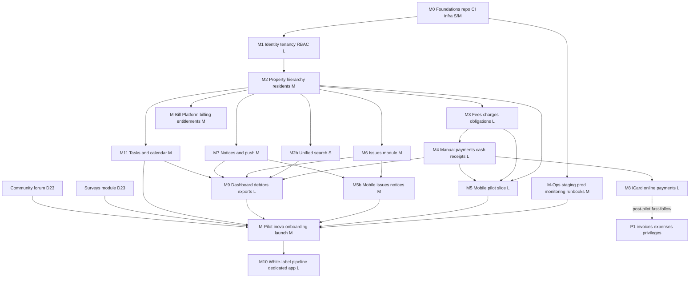

# inova — Multi-Tenant White-Label Property Management Platform

## Implementation Plan (index)

> **This file is the index.** The plan is split by topic under [plan/](plan/)
> and by phase under [milestones/](milestones/). Section numbers (§) are kept
> from the original single document, so a reference such as "§8.3" or "§4.7"
> resolves through the section map below.
>
> **Progress does not live here.** Current state: [current.md](current.md).
> Architecture extract: [architecture.md](architecture.md).

---

## Executive summary

inova is a multi-tenant B2B SaaS platform for professional property-management companies, consisting of (1) a web admin panel for property managers, (2) a white-label resident mobile application, and (3) a shared backend. The pilot launches in Bulgaria under the platform's own **inova** brand (acting as the first tenant). The commercial model bills each tenant monthly **per managed property unit** (represented by an apartment/property row, never by the number of accounts, owners, tenants, or occupants) for a predefined base feature bundle, at a **per-tenant configurable unit price defaulting to 0.80 EUR**, managed by a platform `super_admin` role through the UI (including bulk price updates across all tenants). Premium add-on features (AI integration, shared document signing for block meetings) carry additional per-property fees. Expansion targets are Romania, Serbia, and Poland.

_Historical baseline (2026-09):_ the repository was **empty** when the plan was written, so this was a **pure greenfield project**. There are no existing conventions, prototypes, or technology constraints to inherit. The functional scope supplied in the project brief is treated as the authoritative specification (no PDF file exists in the repository).

Key recommendations, detailed and justified in the files linked from the section map:

- **Architecture (decided by stakeholder):** a **small fixed set of services from day one**: a dedicated **auth service** (issues JWTs carrying one tenant-account realm and multiple applicable roles, verified by other services via JWKS — no runtime call to auth on every request), a **core API** (domain modules behind strict internal boundaries), and a **worker** (queues/cron). Tenant-facing accounts are independent per tenant, including when the same email or phone is used in another white-label application. A person may authenticate accounts in several tenants and the shared mobile app keeps those sessions in a secure local portfolio for explicit tenant switching; every token and API request still authorizes exactly one tenant. Platform operators use separate platform identities. This honors the microservices direction where it pays off (authentication as an isolated security domain) while keeping domain modules co-deployed for low hosting cost; further extraction seams (payments, notifications, exports) remain designed-in.
- **Stack:** TypeScript everywhere. NestJS backend services, PostgreSQL 16 with row-level security for tenant isolation, Redis + BullMQ for background jobs, React (Vite) admin panel, React Native (Expo) resident app, S3 for object storage, Terraform + Helm (scale-out; the pilot is one VM, D19) for infrastructure, GitHub Actions for CI/CD, PostHog for product analytics (already in the team's toolchain), Sentry for errors.
- **Payments (stakeholder preference, validation required):** **iCard** is the preferred provider for resident online payments. Before M8 is locked, confirm its tenant merchant/account structure, settlement flow, Bulgarian onboarding/KYC, payment initiation, webhooks, refunds, reconciliation, and sandbox capabilities. The domain remains behind a `PaymentProvider` port and the pilot can use bank transfer/manual reconciliation. Platform revenue (0.80 EUR/managed property unit + add-ons, never per end-user account) remains a separate subscription flow; Stripe Billing is the current default for that platform-to-tenant billing unless stakeholders choose otherwise.
- **Database scale:** designed for **2,000+ tenants with thousands of end customers each**. Shared schema with `tenant_id`-leading composite indexes and RLS as the baseline; declarative **hash partitioning by `tenant_id`** on high-volume tables as they grow; Citus/sharding as the scale-out path. Schema-per-tenant is explicitly rejected at this tenant cardinality (§4.7 explains why).
- **White-label:** one shared mobile codebase, two distribution modes — (A) dedicated per-partner apps compiled from brand config with unique bundle IDs, submitted from the _partner's own_ Apple/Google developer accounts, and (B) a shared multi-brand app with runtime tenant selection for smaller partners. A store-compliance program (differentiation records, partner-as-provider onboarding) mitigates Apple 4.3 Spam / Google Repetitive Content risk.
- **Tenant isolation:** every request is authorized by its authenticated tenant-account context; PostgreSQL RLS enforces `tenant_id` scoping at the database layer as a second line of defense. A client-side tenant or role switch changes presentation/context only. Bundle ID / client config is never a security boundary.
- **Financial correctness:** immutable ledger-style records (charges, payments, allocations); corrections happen only via reversal/credit-note entries; gapless per-tenant document numbering; idempotent payment webhooks.
- **Pilot path:** milestones are ordered so a thin end-to-end slice (admin creates building + resident accounts → resident activates via invite code, sees obligations, pays by bank reference → admin records payment) is testable as early as milestone M5, before online payments, surveys, or white-label tooling.
- **Resident onboarding (decided by stakeholder):** residents do **not** self-register. The tenant (house manager) creates the resident account with the verified apartment/address data, and the platform sends a one-time **invite code via SMS or Viber**; the resident activates the account by entering the code. This guarantees address correctness and removes form-filling friction for end users.

---

## Brand identity

The machine-readable source of truth is [brands/inova/brand.json](../brands/inova/brand.json) (palette, gradients, light/dark theme tokens, radii, feature flags); the mobile palette is listed in AGENTS.md → UI conventions, the admin glass tokens are generated from Figma into `apps/admin/src/styles.css` ([design.md](design.md)). UI code consumes tokens, never hardcoded hex.

---

## Section map

| §                                      | Content                                                                                                   | File                                               |
| -------------------------------------- | --------------------------------------------------------------------------------------------------------- | -------------------------------------------------- |
| 1, 4, repository structure             | Repository assessment, service topology, stack, white-label strategy, tenant isolation, DB scale          | [plan/system-design.md](plan/system-design.md)     |
| 2, Open decisions (D-table), Remaining | Blocking questions B1–B15, defaults, assumptions, decisions D1–D28, what still needs a stakeholder answer | [plan/decisions.md](plan/decisions.md)             |
| 3, Requirements traceability           | P0 / P1 / P2 boundaries and the feature → milestone matrix                                                | [plan/scope.md](plan/scope.md)                     |
| 5                                      | Entity map, entity notes and state machines, immutability, calculated vs stored, money/time/numbering     | [plan/data-model.md](plan/data-model.md)           |
| 6                                      | Authentication, authorization and permission keys, hardening, backups, GDPR                               | [plan/security.md](plan/security.md)               |
| 7                                      | Delivery plan — overview below, one file per phase                                                        | [milestones/](milestones/)                         |
| 8                                      | Endpoint groups, payment flow contracts, push delivery, accounting boundary, background jobs              | [plan/api.md](plan/api.md)                         |
| 9, 10                                  | Testing strategy and release blockers, pilot launch checklist, success criteria                           | [plan/testing-release.md](plan/testing-release.md) |
| WL.1–WL.4                              | White-label distribution model and store-compliance program                                               | [plan/white-label.md](plan/white-label.md)         |
| Risk register                          | Risks, likelihood, impact, mitigation, owner                                                              | [plan/risks.md](plan/risks.md)                     |
| Final ordered task checklist           | Small, independently implementable backlog items                                                          | [plan/backlog.md](plan/backlog.md)                 |

Feature-level screen contracts live in [features/](features/) — currently the
admin dashboard, [features/admin-dashboard.md](features/admin-dashboard.md).

**Settled decisions are not re-litigated.** Anything marked RESOLVED / Decided
in [plan/decisions.md](plan/decisions.md) or [architecture.md](architecture.md)
stands until a stakeholder changes it.

---

## 7. Delivery plan

Effort scale: S (≤2 days), M (≤1 week), L (2–3 weeks), XL (>3 weeks) for a single engineer; parallelism noted. No calendar dates.

### Milestone dependency map

**Parallel tracks after M1:** Track A (backend billing: M3→M4→M8/M9), Track B (mobile: M5 scaffolding can start against mocked OpenAPI right after M1), Track C (issues/notices/tasks/search: M6, M7, M11, M2b — all need only M2), Track D (infra/M-Ops continuous). M9 is where the tracks meet: it assembles the dashboard from A and C, so a late Track C card ships as an empty state rather than blocking M9. One engineer per track works; two engineers cover A+B with C/D interleaved.

---

### Phases

Each phase is one file: goal, dependencies, tables, backend, admin, mobile,
tests, acceptance, risks. Status is tracked in [current.md](current.md), not
here. **A phase is closed only after its required tests exist and pass** —
the checklist is in [AGENTS.md](../AGENTS.md) → Closing a phase.

| Phase   | Scope                                                                                                 | Effort | Depends on                                                                                                         | Priority                                                                                           | File                                                                    |
| ------- | ----------------------------------------------------------------------------------------------------- | ------ | ------------------------------------------------------------------------------------------------------------------ | -------------------------------------------------------------------------------------------------- | ----------------------------------------------------------------------- |
| M0      | Foundations: repo, CI, local infra, app shells                                                        | S/M    | —                                                                                                                  | P0                                                                                                 | [M0-foundations.md](milestones/M0-foundations.md)                       |
| M1      | Identity, tenancy, RBAC (incl. B8 tenant-account realms)                                              | L      | M0                                                                                                                 | P0                                                                                                 | [M1-identity.md](milestones/M1-identity.md)                             |
| M2      | Property hierarchy and resident linking                                                               | M      | M1                                                                                                                 | P0                                                                                                 | [M2-property.md](milestones/M2-property.md)                             |
| M2b     | Unified admin search                                                                                  | S      | M2                                                                                                                 | P0                                                                                                 | [M2b-search.md](milestones/M2b-search.md)                               |
| M3      | Fee engine, charges, obligations                                                                      | L      | M2, worker skeleton (M1)                                                                                           | P0                                                                                                 | [M3-fees.md](milestones/M3-fees.md)                                     |
| M4      | Manual payments, cash accounts, receipts                                                              | L      | M3                                                                                                                 | P0                                                                                                 | [M4-payments.md](milestones/M4-payments.md)                             |
| M5      | Mobile pilot slice hardening                                                                          | L      | M2, M3, M4 (mockable from M1)                                                                                      | P0                                                                                                 | [M5-mobile-pilot.md](milestones/M5-mobile-pilot.md)                     |
| M6      | Issues module (incl. priority, dashboard summary)                                                     | M      | M2                                                                                                                 | P0                                                                                                 | [M6-issues.md](milestones/M6-issues.md)                                 |
| M7      | Notices and push (incl. debtors audience type, unread count, bulk messages with templates — D23, D28) | M      | M2                                                                                                                 | P0                                                                                                 | [M7-notices-push.md](milestones/M7-notices-push.md)                     |
| M5b     | Mobile issues and notices                                                                             | M      | M6, M7                                                                                                             | P0                                                                                                 | [M5b-mobile-issues-notices.md](milestones/M5b-mobile-issues-notices.md) |
| M11     | Staff tasks and calendar                                                                              | M      | M2                                                                                                                 | P0 — staff tasks may slip behind the pilot; the resident-visible contractor calendar (D23) may not | [M11-tasks-calendar.md](milestones/M11-tasks-calendar.md)               |
| M9      | Dashboard ("Табло"), debtor reporting, first exports; the Документи and Справки sections (D23)        | L      | M4 (hard); M2b, M6, M7, M11 (cards)                                                                                | P0                                                                                                 | [M9-dashboard-reports.md](milestones/M9-dashboard-reports.md)           |
| M-Ops   | Pilot: single-VM production with off-box backups (D19). Scale-out: EKS, monitoring, runbooks          | M      | M0, continuous                                                                                                     | P0                                                                                                 | [M-Ops.md](milestones/M-Ops.md)                                         |
| M-Pilot | inova onboarding and launch                                                                           | M      | M5, M5b, M7, M9, M-Ops; since D23 the surveys module, Community, M11 (contractor calendar), tenant-named menu item | P0                                                                                                 | [M-Pilot.md](milestones/M-Pilot.md)                                     |
| M8      | Online payments via iCard                                                                             | L      | M4, B1 validation                                                                                                  | P1 fast-follow                                                                                     | [M8-online-payments.md](milestones/M8-online-payments.md)               |
| M-Bill  | Platform billing and entitlements                                                                     | M      | M2, M1                                                                                                             | P1 (pre-commercial)                                                                                | [M-Bill.md](milestones/M-Bill.md)                                       |
| M10     | White-label build pipeline + first dedicated partner app                                              | L      | M-Pilot                                                                                                            | P1                                                                                                 | [M10-white-label.md](milestones/M10-white-label.md)                     |
| P1 wave | Invoices, expenses, privileges, campaigns, exports, … (surveys moved before the pilot, D23)           | mixed  | pilot                                                                                                              | P1                                                                                                 | [P1-wave.md](milestones/P1-wave.md)                                     |

**Adding to the plan:** a new phase gets its own file in `milestones/` and one
row here plus one node in the dependency map; a new decision goes in
[plan/decisions.md](plan/decisions.md); a new screen or flow that spans phases
gets a brief in [features/](features/). Nothing else belongs in this index.
