# Domain and data model

Part of the [implementation plan](../implementation-plan.md). Section numbers (§) are the plan's own; its index maps each § to a file.

## 5. Domain and data model

### 5.1 Entity map

```mermaid
erDiagram
  TENANT ||--o{ BRAND : owns
  TENANT ||--o{ USER : contains_accounts
  TENANT ||--o{ STAFF_MEMBERSHIP : has
  USER ||--o{ STAFF_MEMBERSHIP : holds
  USER ||--o{ OCCUPANCY : holds
  USER ||--o{ BUILDING_MANAGER_ASSIGNMENT : receives
  BUILDING ||--o{ BUILDING_MANAGER_ASSIGNMENT : scopes
  STAFF_MEMBERSHIP }o--|| ROLE : granted
  TENANT ||--o{ BUILDING : manages
  BUILDING ||--o{ ENTRANCE : contains
  ENTRANCE ||--o{ APARTMENT : contains
  APARTMENT ||--o{ OCCUPANCY : occupied_by
  OCCUPANCY ||--o{ PET : declares
  TENANT ||--o{ FEE_RULE : defines
  FEE_RULE ||--o{ CHARGE : generates
  APARTMENT ||--o{ CHARGE : billed_to
  CHARGE ||--o{ PAYMENT_ALLOCATION : settled_by
  PAYMENT ||--o{ PAYMENT_ALLOCATION : allocates
  BANK_TRANSACTION ||--o| PAYMENT : becomes_when_matched
  PAYMENT }o--|| CASH_ACCOUNT : credited_to
  BUILDING ||--o{ CASH_ACCOUNT : holds
  CASH_ACCOUNT ||--o{ LEDGER_ENTRY : records
  TENANT ||--o{ EXPENSE : incurs
  EXPENSE }o--o| CONTRACTOR : paid_to
  TENANT ||--o{ EXPENSE_PAYMENT_BATCH : initiates
  EXPENSE_PAYMENT_BATCH ||--o{ EXPENSE : groups
  PAYMENT ||--o| RECEIPT : evidenced_by
  TENANT ||--o{ INVOICE : issues
  INVOICE ||--o{ CREDIT_NOTE : corrected_by
  APARTMENT ||--o{ ISSUE : reports
  ISSUE ||--o{ ATTACHMENT : includes
  TENANT ||--o{ NOTICE : publishes
  USER ||--o{ NOTIFICATION : receives
  TENANT ||--o{ TASK : schedules
  BUILDING ||--o{ TASK : scopes
  USER ||--o{ TASK : assigned_to
  TENANT ||--o{ STORED_DOCUMENT : files
  BUILDING ||--o{ STORED_DOCUMENT : relates_to
  STORED_DOCUMENT ||--o{ ATTACHMENT : stored_as
  TENANT ||--o{ PRIVILEGE_PARTNER : lists
  TENANT ||--o{ SURVEY : runs
  SURVEY ||--o{ BALLOT : issues
  BALLOT ||--o| VOTE : cast_as
  USER ||--o{ SURVEY : proposes
  TENANT ||--o{ REMOVAL_REQUEST : governs
  TENANT ||--o{ AUDIT_RECORD : logs
  TENANT ||--o{ EXPORT_JOB : requests
  TENANT ||--o| SUBSCRIPTION : billed_by
  SUBSCRIPTION ||--o{ ENTITLEMENT : grants
  TENANT ||--o{ USAGE_SNAPSHOT : metered
```

### 5.2 Entity notes and status transitions

| Entity                                | Key notes                                                                                                                                                                                                                                                                                                                                                                                                                                                   | Status transitions                                                                                                |
| ------------------------------------- | ----------------------------------------------------------------------------------------------------------------------------------------------------------------------------------------------------------------------------------------------------------------------------------------------------------------------------------------------------------------------------------------------------------------------------------------------------------- | ----------------------------------------------------------------------------------------------------------------- |
| `tenant`                              | Client organization; may be a property-management company or a developer/builder. Holds locale/currency/timezone/settings JSON and provider-neutral resident-payment configuration. iCard-specific merchant/account identifiers and onboarding states are added only after B1 integration validation                                                                                                                                                        | `trial → active → suspended → offboarded`                                                                         |
| `subscription`                        | Platform billing per tenant (Stripe Billing subscription id, **per-tenant unit price** — default 0.80 EUR per managed property/apartment row, never per account, super_admin-configurable with bulk update, price history kept for invoice auditability, currency, status)                                                                                                                                                                                  | `trialing → active → past_due → canceled`                                                                         |
| `entitlement`                         | Feature grants per tenant: base bundle + add-ons (`ai_integration`, `document_signing`, …) with per-managed-property add-on price refs; enforced server-side by a feature guard; managed via super_admin console                                                                                                                                                                                                                                            | `active → suspended → removed`                                                                                    |
| `usage_snapshot`                      | Immutable monthly metering record per tenant: **count of managed property/apartment rows, never accounts or occupants** (B6 resolved), per-entitlement counts, unit prices in effect, computed at period close; reported to Stripe Billing as metered usage                                                                                                                                                                                                 | —                                                                                                                 |
| `brand`                               | 1..n per tenant; distribution mode (`dedicated`/`shared`); config JSON; store identifiers                                                                                                                                                                                                                                                                                                                                                                   | `draft → live → retired`                                                                                          |
| `user` / tenant account               | Belongs to one tenant realm. Normalized email and phone are each unique within that tenant but may repeat in other tenants. A person may authenticate several such accounts and switch them in the shared app, but credentials, token families, recovery, data, and user-facing identity remain tenant-bound and are never automatically merged or disclosed across realms                                                                                  | `pending_verification → active → disabled → erased(GDPR)`                                                         |
| platform user                         | Separate platform-operator identity; never reused as a tenant-facing resident account                                                                                                                                                                                                                                                                                                                                                                       | `active → suspended → disabled`                                                                                   |
| `staff_membership`                    | Tenant-local `(user, role_set)` assignment; invitation-based. The same account may also hold resident occupancies                                                                                                                                                                                                                                                                                                                                           | `invited → active → suspended → revoked`                                                                          |
| `role` / permissions                  | Per-tenant custom roles composed of fixed permission keys (e.g. `billing.write`, `issues.manage`)                                                                                                                                                                                                                                                                                                                                                           | —                                                                                                                 |
| `building` / `entrance` / `apartment` | Building setup selects an assessment basis; a building has `city` and `district` as separate columns (D24). Apartment carries floor, number, area m², property type (`apartment` / `garage` / `shop` / `storage`), rooms and ideal parts (D26). Unique business key: `(tenant, building, entrance, floor, apartment_number)`; UUID remains the technical key                                                                                                | building: `draft → active → archived`; apartment: `active → archived`                                             |
| `occupancy`                           | Tenant-local `(user, apartment, role, valid_from/valid_to)`; admin-verified. One account may have several roles/occupancies and multiple simultaneous `owner` occupancies are allowed. A selected mobile view changes presentation only; effective server permissions remain context-derived and voting is owner-only                                                                                                                                       | `requested → verified → active → ended → rejected`                                                                |
| `pet`                                 | Linked to an occupancy/apartment with `valid_from/valid_to`, so pet-sensitive rules use the population effective for the fee period                                                                                                                                                                                                                                                                                                                         | `active → ended`                                                                                                  |
| `building_manager_assignment`         | Grants house-manager permissions for one or more buildings independently of employer. Assignee may be tenant staff, a resident owner, or a platform-employed operator acting through this scoped role                                                                                                                                                                                                                                                       | `invited → active → suspended → ended`                                                                            |
| `removal_request`                     | Reasoned request by a house manager to remove/end a resident account/occupancy or archive an apartment after building activation; decided by `super_admin`, fully audited. The author may edit it or withdraw it while it is pending (D27)                                                                                                                                                                                                                  | `pending → approved → applied`; `pending → rejected` or `withdrawn` (D27)                                         |
| `fee_rule`                            | Basis comes from the building configuration: `fixed / per_area / per_occupant / per_ideal_part / per_room` (extensible); kind `fixed` (monthly) or `temporary` (`valid_from` / `valid_to`, D26); scope building / entrance / property-type / a stored list of chosen properties (temporary rules, D26); effective-dated and versioned (new version, never edit in place)                                                                                    | `active → superseded → archived`                                                                                  |
| `charge`                              | Immutable obligation row generated from a rule or entered ad hoc; `(apartment, period, amount, currency, due_date)`                                                                                                                                                                                                                                                                                                                                         | `open → partially_paid → settled → reversed` (derived, see §5.4)                                                  |
| `bank_transaction`                    | Immutable external inbound transaction. Payment reference is used to propose an apartment match; unmatched/ambiguous items remain in a staff reconciliation queue and do not silently affect the ledger                                                                                                                                                                                                                                                     | `unmatched → proposed_match → matched / ignored`                                                                  |
| `payment`                             | Immutable; source `manual / bank_import / provider`; provider code; source bank transaction or external payment/account refs; idempotency key. iCard is the preferred online provider pending B1 contract validation                                                                                                                                                                                                                                        | `pending → confirmed → failed → refunded` (provider); manual are `confirmed` at entry, corrected only by reversal |
| `payment_allocation`                  | Immutable `(payment, charge, amount)` split                                                                                                                                                                                                                                                                                                                                                                                                                 | —                                                                                                                 |
| `cash_account`                        | Per building, logical `operational` and `deposit`/repair-fund sub-ledgers over the same real bank account; balances are **derived** from ledger. A building flag controls whether inter-fund transfers are allowed                                                                                                                                                                                                                                          | —                                                                                                                 |
| `ledger_entry`                        | Append-only double-entry-style rows for every money movement (charge issuance optional, payment in, expense out, transfer between accounts, reversal)                                                                                                                                                                                                                                                                                                       | —                                                                                                                 |
| `expense`                             | Building cost, optional contractor, optional recurrence/payment schedule. Realized payments stay immutable even when created from a schedule or batch                                                                                                                                                                                                                                                                                                       | `draft → approved → paid → reversed`                                                                              |
| `expense_payment_batch`               | House-manager instruction grouping multiple contractor payments for one initiation/review action; every item produces its own payment/ledger history                                                                                                                                                                                                                                                                                                        | `draft → submitted → processing → completed / partially_failed / failed`                                          |
| `receipt` / `invoice` / `credit_note` | Numbered documents; gapless per-tenant series; rendered PDF stored in S3; invoice corrections only via credit note. The house manager designates one verified owner occupancy as the apartment's current document recipient                                                                                                                                                                                                                                 | invoice: `issued → corrected → void(by credit note)`                                                              |
| `issue`                               | Reporter occupancy, category, photos, **`priority` (`normal` / `urgent`, default `normal`)**. Priority is orthogonal to status — an issue can be pending and urgent at once — is set by staff during triage, and every change writes an `issue_event`. Dashboard grouping: pending = `reported` + `acknowledged`; planned = `planned` + `in_progress`; open = everything except `resolved` / `closed` / `rejected`                                          | `reported → acknowledged → planned → in_progress → resolved → closed` (+ `rejected`); full history table          |
| `attachment`                          | Polymorphic `(owner_type, owner_id)`; S3 key, mime, size, AV-scan status. Owned by the shared `files` module; an attachment always has an owner                                                                                                                                                                                                                                                                                                             | `uploaded → scanned_clean / scanned_infected → deleted`                                                           |
| `stored_document`                     | Library entry for a file uploaded without a domain object (dashboard "upload document"): category (`supplier_invoice` / `building_document` / `other`), title, optional `building_id`, optional period, uploader. It is the owner of its attachment (`owner_type = 'stored_document'`), which keeps the "attachments always have an owner" rule. A supplier invoice can later be linked to a P1 `expense` without moving the file. Pending D15              | `active → archived`                                                                                               |
| `task`                                | Staff calendar item, one entity for tasks and events (`kind`: `task` / `event`): title, notes, optional building / entrance, `scheduled_on` (calendar day in the tenant timezone, indexed `(tenant_id, scheduled_on)`), optional `starts_at`, optional `due_at` (deadline-only items have no start), optional assignee, `completed_at` / `completed_by`. No recurrence or reminders in v1. Not a financial record — ordinary UPDATE is allowed. Pending D17 | `open → done` (reopen allowed) `/ cancelled`                                                                      |
| `notice`                              | Category, audience (all / buildings / entrances / apartments / **`debtors`**), publish window. A `debtors` audience is a rule (scope + optional minimum amount / days overdue) resolved server-side at send time from the debtor query, never a client-supplied recipient list                                                                                                                                                                              | `draft → published → archived`                                                                                    |
| `notification`                        | Per-recipient delivery record; channel push / email / SMS / Viber (D23); payload ref. A bulk message is a template with placeholders rendered per recipient (D28)                                                                                                                                                                                                                                                                                           | `queued → sent → delivered → failed → read`                                                                       |
| `privilege_partner` / `privilege`     | Tenant-scoped partner + offers with validity                                                                                                                                                                                                                                                                                                                                                                                                                | `active → expired → disabled`                                                                                     |
| `survey` / `ballot` / `vote`          | A verified owner proposes a survey; a house manager approves/rejects it and selects `per_apartment` or `per_ideal_part` weighting. The manager may also author a survey directly (`surveys.create`, skips `pending_approval` — D16). Surveys and proposals filter by `building_id` (D24). Approval publishes to eligible building owners and queues push. Voting is owner-only and a vote is immutable once cast. Co-owner ballot allocation remains open   | survey: `draft → pending_approval → approved / rejected → open → closed → protocol_issued`                        |
| `community_topic` / `community_post`  | Forum topics residents post and staff edit or remove (D23); the module's milestone is still to be cut and Still open 10 (who opens a topic, soft removal, per building or entrance) must close first; private 1:1 messages are a separate P1 module                                                                                                                                                                                                         | to be cut                                                                                                         |
| `audit_record`                        | Append-only: actor, tenant, action, entity ref, before/after JSON diff, IP, request id                                                                                                                                                                                                                                                                                                                                                                      | —                                                                                                                 |
| `export_job`                          | Requested report/export; produces S3 artifact                                                                                                                                                                                                                                                                                                                                                                                                               | `queued → running → done → failed`                                                                                |

### 5.3 Financial immutability and auditability

- `charge`, `payment`, `payment_allocation`, `ledger_entry`, `receipt`, `invoice`, `credit_note` are **append-only**: no UPDATE of monetary fields, no DELETE (enforced by DB triggers raising exceptions, plus revoked UPDATE/DELETE grants for the app role on monetary columns).
- Corrections are new rows: a wrong payment gets a `reversal` ledger entry + a reversing payment record referencing the original (`reverses_payment_id`); a wrong invoice gets a credit note.
- Every financial mutation writes an `audit_record` in the same transaction.
- Document PDFs are content-hashed; the hash is stored on the document row so tampering is detectable.
- Contractor payment batches and recurring schedules are instructions, not mutable substitutes for realized money movement: each execution creates individual immutable expense/payment/ledger records.
- External bank transactions affect apartment balances only after a deterministic or staff-confirmed match; the source transaction and matching decision remain auditable.

### 5.4 Calculated vs. stored

| Value                                                                                    | Stored or calculated                                                                                                                                                                                                                                                                                                                                                                                                  | Rationale                                                                       |
| ---------------------------------------------------------------------------------------- | --------------------------------------------------------------------------------------------------------------------------------------------------------------------------------------------------------------------------------------------------------------------------------------------------------------------------------------------------------------------------------------------------------------------- | ------------------------------------------------------------------------------- |
| Charge amount                                                                            | **Stored** at generation time (rule inputs snapshotted onto the charge)                                                                                                                                                                                                                                                                                                                                               | Rule changes must not rewrite history                                           |
| Charge status (`open/partially_paid/settled`)                                            | **Calculated** from allocations (materialized as a column updated by trigger for query speed, but derivable)                                                                                                                                                                                                                                                                                                          | Single source of truth = allocations                                            |
| Apartment / building outstanding balance                                                 | **Calculated** (SQL view); cached per-building aggregates refreshed by worker for dashboard                                                                                                                                                                                                                                                                                                                           | Avoid drift                                                                     |
| Operational/deposit logical fund balance                                                 | **Calculated** from `ledger_entry` sum; periodic snapshot rows for fast paging and audit checkpoints                                                                                                                                                                                                                                                                                                                  | Both funds may share one real bank account; the logical ledger is truth         |
| Debtor list                                                                              | Calculated view                                                                                                                                                                                                                                                                                                                                                                                                       |                                                                                 |
| Dashboard period aggregates (charged, collected, outstanding; paid / charged apartments) | **Calculated**, cached in `dashboard_building_period_rollups (tenant_id, building_id, period, currency, …)` refreshed by the worker. Keyed per building so any permitted scope is a SUM over its buildings — one cache serves tenant-wide and building-scoped roles. `collected` counts allocations against the period's charges, not cash received in the month, so `charged = collected + outstanding` always holds | Derived cache, rebuildable from the ledger at any time; never a source of truth |
| Issue counters by state and priority; task counts per day                                | Calculated on request (small, tenant- and building-indexed)                                                                                                                                                                                                                                                                                                                                                           | No cache until measurements say otherwise                                       |
| Invoice totals, VAT lines                                                                | **Stored** on the document                                                                                                                                                                                                                                                                                                                                                                                            | Legal document must be frozen                                                   |

### 5.5 Money, currency, time, numbering, idempotency, deletion

- **Money:** `NUMERIC(14,2)` + `currency CHAR(3)` on every monetary column; arithmetic in application code uses integer minor units (a `Money` value object in `packages/shared`); no floats anywhere. Rounding: half-up at document line level, documented per country module.
- **Currencies:** EUR from the pilot (A-EUR resolved); BGN exists only as the source currency of imported opening balances, converted once at 1.95583. Schema currency-explicit from day one; per-tenant default currency; no dual display (A-EUR).
- **Time zones:** DB `timestamptz` (UTC). Billing-period boundaries computed in the tenant's timezone by the fee-generation job. Dates that are legally "dates" (invoice date, due date) stored as `date`.
- **Document numbering:** `document_counters (tenant_id, series, next_value)` table; increment with `SELECT … FOR UPDATE` inside the issuing transaction → **gapless** sequential numbers per tenant and series (required for BG invoices pending B2). Receipts/invoices get separate series.
- **Idempotency:** client-supplied `Idempotency-Key` header on POST endpoints that create money records (manual payments, payment initiation); server stores `(tenant_id, key, response_hash)` for 48 h and replays the stored response on retry. Provider webhooks deduplicated by unique index on `(provider, provider_event_id)`.
- **Controlled removal / soft deletion:** house managers may add and correct data but cannot directly remove resident accounts or active apartments. During building `draft` setup, apartments may be added/removed freely. After activation, a reasoned `removal_request` requires `super_admin` approval; records with history are ended/archived, not hard-deleted. Other master data uses `deleted_at`. Financial records are never soft- or hard-deleted (reversals only). GDPR erasure anonymizes user PII columns while preserving financial rows (lawful basis: bookkeeping obligations — confirm retention periods with counsel, see §6.6).
