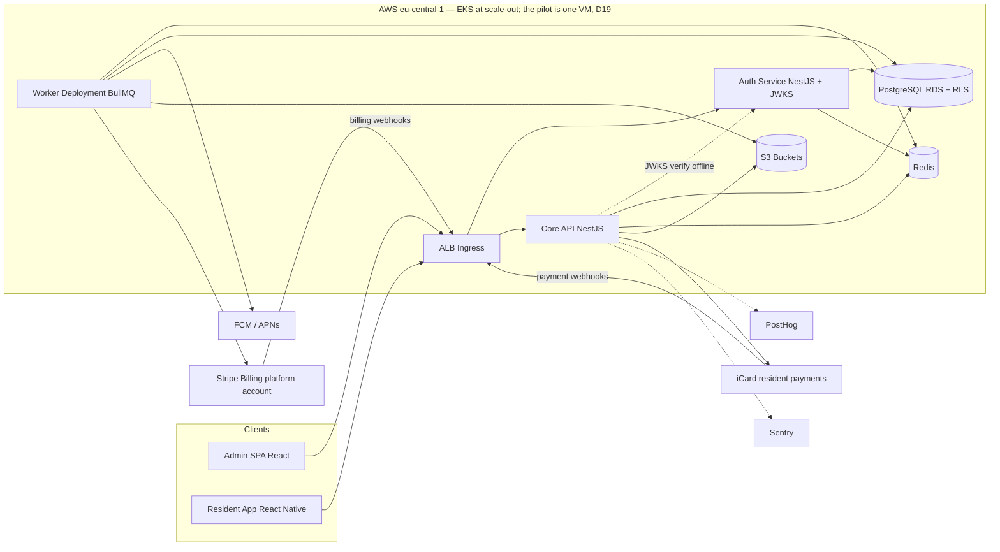

# System design

Part of the [implementation plan](../implementation-plan.md). Section numbers (§) are the plan's own; its index maps each § to a file.

Short extract of the invariants: [architecture.md](../architecture.md).

## 1. Repository assessment

> **Historical.** This is the assessment made before the first commit, kept for
> the record. The repository now holds the services, apps and migrations listed
> in [current.md](../current.md); the greenfield verdict no longer describes it.

| Question                                     | Finding                                                                                                                                                                                                                                                                                                                                                                                      |
| -------------------------------------------- | -------------------------------------------------------------------------------------------------------------------------------------------------------------------------------------------------------------------------------------------------------------------------------------------------------------------------------------------------------------------------------------------- |
| What exists                                  | Nothing. `/Users/mihailsfolder/dev/inova` contains only an initialized `.git` directory with **zero commits**, no branches, no files.                                                                                                                                                                                                                                                        |
| Reusable code / prototypes                   | None found.                                                                                                                                                                                                                                                                                                                                                                                  |
| Existing conventions or technology decisions | None in the repository. One external signal: the user's stored Cursor rules describe React Native screen conventions (conditional styling by `screenWidth`, Android-first support), implying prior/intended React Native mobile work — this plan adopts React Native accordingly. A PostHog MCP integration is configured in the workspace, implying PostHog is the intended analytics tool. |
| Database definitions, deployment files, docs | None.                                                                                                                                                                                                                                                                                                                                                                                        |
| PDF specification                            | Not present in the repository. The functional scope from the project brief is treated as the spec; the traceability matrix in [scope.md](scope.md) maps that scope.                                                                                                                                                                                                                          |
| Verdict                                      | **Greenfield.** All foundations (monorepo layout, CI, environments, schema, apps) must be created. Technical debt: zero, but so is leverage — every choice below is a fresh decision.                                                                                                                                                                                                        |

## 4. Recommended architecture

### 4.1 Shape: microservices, minimal set (decided) — dedicated auth service + core API + worker

Stakeholder decision: microservices from day one, with authentication separated at minimum and the authenticated **tenant account realm + roles coded into the JWT**. Tenant-facing accounts are independent per tenant; this supersedes the original cross-tenant global-user login model. To honor this while keeping hosting cost minimal, the day-one topology is a **fixed set of three services** rather than a service-per-module fleet:

1. **`auth-service`** — owns tenant accounts, credentials, tenant-bound refresh-token families, staff role assignments, and separate platform identities. Tenant-account credentials are unique only inside their tenant realm; the same email/phone in another realm is an unrelated account and no auth response reveals that it exists. It issues short-lived (10–15 min) access tokens signed with an asymmetric key (RS256/ES256). Tenant token claims: `sub` (tenant-account id), `tenant_id`, `kind: staff|resident`, and `roles[]`; one account may carry several applicable roles, but every token authorizes only one tenant. Platform tokens use a separate platform subject with optional `platform_role` (`super_admin`, §6.2). The selected brand/organization identifies the realm before login through a server-side mapping, but is never authorization by itself. The shared mobile app may retain multiple tenant-bound sessions in secure storage and request a new access token for the selected context; the server does not mint one cross-tenant token. The service publishes a **JWKS endpoint**, so all other services verify tokens locally with zero runtime calls to auth — auth being down never blocks already-authenticated traffic.
2. **`core-api`** — the domain modules (`tenancy`, `property`, `billing`, `payments`, `finance`, `documents`, `files`, `issues`, `notices`, `notifications`, `tasks`, `privileges`, `surveys`, `community` (D23, to be cut), `reports`, `platform-billing`) behind strict internal boundaries. `files` owns the shared attachment infrastructure and the uploaded-document library; `documents` stays reserved for numbered fiscal documents (receipts, invoices, credit notes).
3. **`worker`** — BullMQ consumers and cron (fee generation, push fan-out, PDFs, webhooks processing, metering, backups).

**Handling JWT claim staleness** (the trade-off of tenant/roles-in-token): access-token TTL of 10–15 minutes bounds how long a revoked role assignment can linger; for immediate revocation (staff dismissal, security incident) auth-service writes the account id to a small Redis denylist that core-api checks on each request (one O(1) lookup, no auth-service call). **If Redis is unreachable the check fails open for ordinary requests** — a cache outage must not take the platform down, and exposure stays bounded by the token lifetime — while sensitive operations keep their database re-check and therefore stay closed; every fail-open decision is logged and alerts (D20). Refresh-token rotation re-reads the tenant account and role assignments from the database, so every token refresh picks up grant changes.

Rules that keep future extraction cheap (e.g., `notifications` for fan-out scale, `payments` for compliance blast-radius):

- Modules communicate through interfaces and an in-process event bus (NestJS CQRS events) — never by reaching into another module's tables.
- Each module owns its DB tables (enforced by lint rule on import paths + schema ownership doc).
- Async side effects (push, email, PDF, exports, webhook processing) run only in the worker via queues.
- Service-to-service calls (core-api → auth-service admin operations like invitations) go over authenticated internal HTTP with OpenAPI contracts, same as any future extracted service.

At scale-out this deploys on EKS as 3 deployments + cron jobs; the pilot runs the same three on one VM with the compose stack (D19) — microservice boundaries where they carry their weight, without a 10-service fleet's cost.



### 4.2 Stack decisions with alternatives

| Layer            | Recommendation                                                                                                                                | Alternative considered                            | Why the recommendation wins                                                                                                                                                                                            |
| ---------------- | --------------------------------------------------------------------------------------------------------------------------------------------- | ------------------------------------------------- | ---------------------------------------------------------------------------------------------------------------------------------------------------------------------------------------------------------------------- |
| Backend          | NestJS + TypeScript (auth-service + core-api + worker)                                                                                        | Go (chi/ent), Django                              | One language across mobile/web/backend for a small team; NestJS modules map 1:1 to the service/module boundary strategy; OpenAPI + codegen for typed clients. Go wins on runtime cost but loses on team velocity here. |
| ORM / migrations | Drizzle ORM for queries + hand-written plain-SQL migrations applied by `db/migrate.mjs` (checksums, advisory locks, one transaction per file) | Prisma, TypeORM, drizzle-kit generated migrations | RLS policies, triggers, roles and gapless counters are hand-written SQL; a generator fights them. The runner is ~100 lines with no extra dependency.                                                                   |
| DB               | PostgreSQL 16 (compose on the pilot VM per D19; RDS at scale-out)                                                                             | Aurora Serverless v2                              | RDS t4g is dramatically cheaper at pilot scale; Aurora is a config change later.                                                                                                                                       |
| Admin            | React + Vite SPA                                                                                                                              | Next.js                                           | No SEO need; static hosting on S3/CloudFront ≈ free; simpler CI.                                                                                                                                                       |
| Mobile           | React Native + Expo prebuild                                                                                                                  | Flutter, native ×2                                | Team convention (existing RN rules), JS/TS reuse, EAS/fastlane multi-brand builds. Flutter equally capable but zero existing team signal.                                                                              |
| Realtime updates | Polling + push notifications for MVP; SSE endpoint for admin dashboard later                                                                  | WebSockets (Socket.io), managed (Ably)            | Nothing in scope needs sub-second realtime; push covers resident freshness; avoids stateful WS infra on EKS at pilot.                                                                                                  |
| Jobs             | BullMQ on Redis                                                                                                                               | SQS + Lambda, Temporal                            | Same codebase/worker, local-dev parity via docker Redis; Temporal is overkill now.                                                                                                                                     |
| Auth             | Dedicated auth-service (tenant-scoped accounts, argon2id, JWT with tenant/account-role claims + rotating refresh, OTP, JWKS)                  | AWS Cognito, Keycloak, Auth0                      | No per-MAU fees, EU residency trivial, full control of isolated white-label account realms (stakeholder requirement). Cognito is the fallback if the team prefers not to own password storage.                         |
| IaC              | Terraform + Helm charts                                                                                                                       | CDK, Pulumi                                       | Widest talent pool; Helm is native to EKS deploys via GitHub Actions.                                                                                                                                                  |
| Observability    | CloudWatch logs + Prometheus/Grafana (kube-prometheus-stack) + Sentry + OpenTelemetry traces                                                  | Datadog                                           | Datadog cost is unjustifiable at pilot; OTel keeps the exit door open.                                                                                                                                                 |
| Analytics        | PostHog (cloud EU)                                                                                                                            | Amplitude, Mixpanel                               | Already in the team's toolchain (MCP configured); EU hosting; feature flags usable for white-label toggles.                                                                                                            |
| PDF generation   | Server-side via headless Chromium (Playwright) in worker                                                                                      | pdfkit, external API                              | HTML templates shared with web previews; runs only in worker to protect API latency.                                                                                                                                   |

### 4.3 White-label strategy (one codebase, configuration-driven)

**Brand configuration model.** A `brands/` directory in the monorepo holds one folder per brand containing _non-secret_ config: `brand.json` (colors, names, locales, feature flags, API base, deep-link domains, store metadata references) and asset folders (icons, splash, store screenshots). The backend serves the same brand config at runtime (`GET /v1/brands/:key/config`) so the shared app and server-rendered artifacts (emails, PDFs) stay consistent. Secrets (signing keys, APNs keys, service accounts) live **only** in the credentials store ([white-label.md](white-label.md)) — never in `brands/`.

**Mode A — dedicated apps (larger partners).** `app.config.ts` reads `BRAND=inova` and produces unique bundle ID (`bg.inova.resident`), package name, display name, icons, deep-link associated domains, and Firebase config file per brand. CI builds each brand as a matrix job. Submission happens from the **partner's own** Apple Developer and Google Play accounts, with the platform operator invited in a release-manager role.

**Mode B — shared multi-brand app (smaller partners).** One store listing under the platform's accounts. A tenant realm is added via: (1) invitation deep link (`https://app.inova.bg/i/<token>`), or (2) organization code entry, then authenticated independently. Branding (theme, logo, strings) is applied at runtime from the brand config API and cached in a tenant-namespaced store. The app may retain several authenticated tenant contexts in secure storage and provide an explicit tenant switcher. Because accounts are tenant-scoped, it never searches other tenants for the same email/phone, never suggests that another account exists elsewhere, and never carries cached data or push context across a switch.

**Security/privacy invariant (both modes):** before login, the client's brand or organization code is a realm-selection hint resolved through a server-side brand-to-tenant mapping. It is not proof of access. After login, the selected session's signed `tenant_id` is authoritative and every API request is authorized against that tenant account and its effective roles. An account registered in tenant X is unrelated to an account with the same email/phone in tenant Y; locally presenting both authenticated contexts in the shared app does not merge them, and neither tenant is told about the other account or the shared platform provider. A role/view selector likewise changes presentation only and cannot add a permission.

### 4.4 Tenant isolation design

1. **Authentication layer:** a tenant-account JWT carries exactly one `tenant_id`, account kind, and roles (stakeholder decision), signed by auth-service and verified via JWKS. Platform identities are separate. Staleness is bounded by short TTL + revocation denylist + refresh-time re-read (§4.1).
2. **Request context:** every authenticated tenant route requires an explicit `X-Tenant-Id` header (or path param); middleware requires it to equal the signed token's `tenant_id` and derives the role set from the token. Absence or mismatch → 403 before any handler code runs. Highly sensitive operations (payments recording, role changes, refunds, removals, GDPR actions) additionally re-verify the tenant account/assignment against the database, not just the token.
3. **Database layer:** all tenant-owned tables carry `tenant_id NOT NULL`; RLS policies (`USING (tenant_id = current_setting('app.tenant_id')::uuid)`) are enabled on every such table. The API sets `app.tenant_id` per transaction. No runtime role is `BYPASSRLS`; only the migration role is. **Each deployable has its own role** (D21): `inova_auth` for auth-service — the only role the cross-tenant `identity_scope` policies are granted to — `inova_app` for core-api, and `inova_worker` when the worker lands. A policy keyed on a session variable is only as strong as the set of roles allowed to use it, so that set is one role. Jobs that span tenants iterate them and set `app.tenant_id` per transaction.
4. **Object storage:** S3 keys are prefixed `tenants/<tenant_id>/…`; presigned URLs are minted only after the same tenant-account and resource-scope check.
5. **Same person in multiple tenants:** the person registers or is invited as a separate account in each tenant realm, even when email/phone are identical. Dedicated white-label apps never expose the relationship. The shared app keeps a device-local index of explicitly authenticated tenant contexts, stores each refresh-token family under a tenant/account key, and switches by activating the chosen context. Server tokens, cached API data, offline queues, deep links, analytics identity, and push routing stay tenant-namespaced; switching never merges accounts or data.
6. **Tests as release blockers:** an automated tenant-isolation test suite (two seeded tenants, every endpoint called cross-tenant, expecting 403/404) runs in CI on every PR.

### 4.5 Multi-apartment / multi-building users

Tenant-facing `users`/accounts belong to exactly one tenant realm; normalized email and phone are unique within that tenant, not globally. A person can therefore participate in several tenants through several tenant accounts and switch between their independently authenticated contexts in the shared app. `occupancies` link an account to an apartment with a role (`owner`, `tenant`, `occupant`, `proxy`) and `valid_from`/`valid_to`. One account may hold many occupancies and several roles inside its tenant, and an apartment may have multiple simultaneous owners with separate accounts. Effective authorization is the server-validated combination of tenant role, manager assignment, selected building/apartment, occupancy role, and effective date. The mobile role/view selector changes navigation only: owner-only capabilities such as voting remain unavailable to tenant/occupant contexts. The mobile home screen provides tenant, role/view, and apartment switching as applicable; notifications carry `(tenant_id, account_id, apartment_id?)` context.

A tenant organization may be a professional property manager or a developer/builder. House-manager authority is modeled as a tenant/building-scoped assignment rather than inferred from who employs the person. The assignee may be tenant staff, a verified resident owner, or a platform-employed operator; the latter acts through the scoped tenant role and normal RLS, never through unrestricted `super_admin` access.

### 4.6 Localization

- All strings in `packages/i18n` (ICU MessageFormat), namespaced per module; `bg` and `en` maintained from day one.
- Locale, currency, date/number formats, and first-day-of-week come from tenant settings, overridable per user.
- No string concatenation in code; plurals via ICU. Romanian/Serbian/Polish become translation deliverables, not engineering work. Country-specific _legal_ logic (invoice rules, VAT) is isolated in per-country policy modules (`packages/country-bg`, later `country-ro`, …).

### 4.7 Database performance and partitioning at 2,000+ tenants

Target scale to design for: **2,000+ tenants × 1,000–5,000 end customers each** → on the order of 2–10 M apartments/users, and the hot append-only tables (charges, ledger entries, notifications, audit records) growing by **tens of millions of rows per year**.

**Why schema-per-tenant is rejected at this cardinality.** 2,000 schemas × ~40 tables ≈ **80,000 relations** (plus indexes, easily 300k+ pg_catalog entries). Consequences: catalog bloat slowing planning and autovacuum, `pg_dump`/restore degradation, connection-pool fragmentation (poolers key on search_path), and — decisive for this product — **migration fan-out** (every schema change × 2,000, with partial-failure states) and **broken cross-tenant queries**, which platform billing (0.80 EUR/managed-property metering), platform analytics, and support tooling all require. Schema-per-tenant is a good pattern at ≤ 50 large tenants; it is the wrong pattern at 2,000 small ones.

**Adopted strategy, in escalation order:**

1. **Baseline (day 1):** single shared schema; `tenant_id` is the **leading column of every primary key and index** on tenant-owned tables (e.g., `PRIMARY KEY (tenant_id, id)`, `INDEX (tenant_id, apartment_id, period)`). Combined with RLS, every query plan is naturally tenant-pruned. Postgres on modest hardware handles hundreds of millions of well-indexed rows.
2. **Declarative partitioning (when a table crosses ~50 M rows or at commercial launch, whichever first):** `PARTITION BY HASH (tenant_id)` with a fixed partition count (32 or 64) on the hot tables — `ledger_entries`, `charges`, `payments`, `notifications`, `audit_records`, `issue_events`. Hash-by-tenant keeps each tenant's rows co-located for locality without 2,000 physical partitions. Because `tenant_id` leads every key, retrofitting partitioning is a data-copy migration, not a schema redesign — but partition the two largest append-only tables (`audit_records`, `notifications`) **from day 1** since they are pure inserts and cheap to start partitioned.
3. **Time-based subpartitioning / retention:** `audit_records` and `notifications` additionally range-partitioned by month (`pg_partman`) so retention becomes `DROP PARTITION` instead of DELETE storms.
4. **Read path:** read replicas for dashboards/reports/exports (reporting queries pinned to replicas); 5-minute cached rollups (§M9) keep dashboards off the raw ledger.
5. **Scale-out (when a single writer saturates):** Citus distributing by `tenant_id` (the schema is already shaped for it), or tenant-group sharding across databases with a tenant→shard directory in auth-service claims. Dedicated databases remain a sellable enterprise-tier option for a handful of very large tenants without changing the main fleet.

**Operational guardrails:** PgBouncer in transaction mode (compatible with `SET LOCAL app.tenant_id`), `work_mem`/autovacuum tuning documented per table class, slow-query log review as a runbook item, and a seed-data performance suite (200 → 2,000 tenant synthetic dataset) run before commercial launch.

## Proposed repository / folder structure

```
inova/  (monorepo: pnpm workspaces + Turborepo)
├── apps/
│   ├── auth-service/           # NestJS: users, credentials, memberships, roles,
│   │                           # JWT issuance + JWKS, refresh rotation, denylist
│   ├── api/                    # NestJS core API (domain modules)
│   │   └── src/modules/{tenancy,property,billing,payments,finance,
│   │                    documents,files,issues,notices,notifications,tasks,
│   │                    privileges,surveys,reports,brands,exports,
│   │                    platform-billing}/
│   ├── worker/                 # BullMQ worker entrypoint (imports api modules)
│   ├── admin/                  # React + Vite admin SPA
│   └── mobile/                 # Expo React Native resident app
├── packages/
│   ├── shared/                 # Money, ids, enums, zod schemas, api types (OpenAPI-generated)
│   ├── i18n/                   # ICU message catalogs (bg, en, later ro/sr/pl)
│   ├── country-bg/             # BG-specific document/VAT/numbering policy
│   └── ui/                     # shared admin UI primitives (optional)
├── brands/
│   └── inova/{brand.json, assets/, store/}   # non-secret brand config
├── db/
│   ├── migrations/             # plain SQL, applied by db/migrate.mjs
│   └── seeds/                  # dev + test seeds (two tenants)
├── infra/
│   ├── terraform/{bootstrap,network,eks,rds,storage,observability}/
│   ├── helm/{api,worker}/
│   └── docker/                 # docker-compose.yml, local service configs
├── .github/workflows/          # ci.yml, deploy-staging.yml, deploy-prod.yml,
│                               # mobile-build.yml (brand matrix)
├── docs/
│   ├── implementation-plan.md  # this document
│   ├── decisions/              # ADRs
│   ├── runbooks/
│   ├── compliance/             # per-brand differentiation records
│   └── guides/                 # staff training, onboarding
└── scripts/                    # import tooling, dev utilities
```
